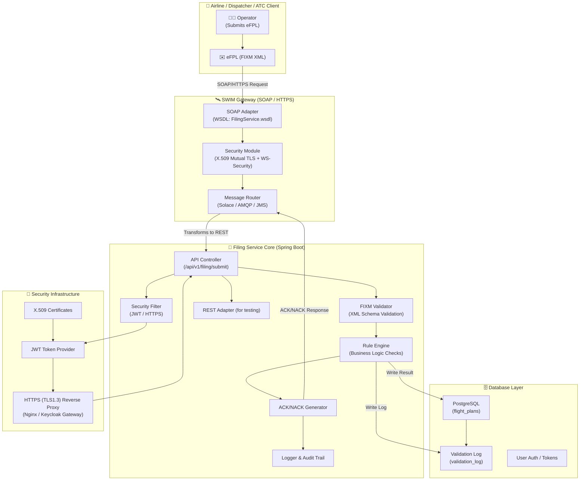

Đánh giá sơ đồ bạn gửi — **rất tốt về mặt logic và cấu trúc hệ thống**.
Tôi nhận xét chi tiết như sau:

---

## 🧠 **Tổng thể kiến trúc**

Sơ đồ của bạn mô tả **kiến trúc chuẩn theo mô hình FF-ICE Filing Service** mà ICAO/FAA khuyến nghị — rất đúng hướng.

### ✅ Ưu điểm:

1. **Tách lớp rõ ràng**

   * `CLIENT` → `SWIM_GATEWAY` → `FILING_CORE` → `DATABASE` → `SECURITY`
     => đúng mô hình layered architecture, dễ bảo trì và scale.

2. **Có đủ 6 khối chức năng cốt lõi:**

   * Adapter (SOAP/REST)
   * Validation
   * Business logic
   * ACK/NACK handler
   * Security & audit
   * Persistence layer
     → tương ứng gần hoàn hảo với khuyến nghị của ICAO FF-ICE Filing Service.

3. **Có SWIM Gateway tách biệt:**

   * SOAP Adapter, WS-Security, Message Router
     → hoàn toàn phù hợp với SWIM-TI Yellow Profile mà EUROCONTROL sử dụng.

4. **Có Security Infrastructure độc lập:**

   * TLS1.3, JWT, X.509, Reverse Proxy (Keycloak/Nginx)
     → đây chính là yêu cầu bắt buộc trong SWIM compliance.

---

## ⚙️ **Điểm có thể cải tiến**

| Thành phần                            | Nhận xét                                                                                                                                    | Đề xuất                                                                                           |
| ------------------------------------- | ------------------------------------------------------------------------------------------------------------------------------------------- | ------------------------------------------------------------------------------------------------- |
| **SG3 – Message Router**              | Bạn ghi “Solace / AMQP / JMS” — đây là đúng, nhưng cần note rằng trong mô hình nhỏ bạn có thể thay bằng Apache ActiveMQ hoặc RabbitMQ.      | Nếu chỉ test nội bộ, dùng **ActiveMQ Artemis** để giảm footprint. Khi production mới dùng Solace. |
| **FS5 – Security Filter (JWT/HTTPS)** | JWT ở Filing Core có thể trùng chức năng với SWIM Gateway (đã xác thực X.509).                                                              | Tách rạch ròi: SWIM layer → mutual TLS; Filing Core → JWT cho nội bộ microservices.               |
| **FS7 – REST Adapter**                | Bạn thêm “for testing” là hợp lý. Nhưng nếu định dùng để integration với airline simulator, cần chuẩn hóa endpoint `/api/v1/filing/submit`. | Thêm OpenAPI/Swagger để auto-doc test API.                                                        |
| **Database – Validation Log**         | Bạn có `validation_log` tách riêng, tốt. Nhưng audit nên chung cơ chế với Filing Core logger.                                               | Gộp logging qua ELK Stack để tiện trace (ElasticSearch + Kibana).                                 |
| **Security – Reverse Proxy**          | Đặt Keycloak song song với Nginx có thể phức tạp.                                                                                           | Giai đoạn đầu chỉ cần Nginx + PKI, sau mới thêm Keycloak.                                         |

---

## 🧩 **So sánh với kiến trúc chuẩn FF-ICE Filing Service**

| Thành phần ICAO Doc 9965    | Trong sơ đồ của bạn | Ghi chú                           |
| --------------------------- | ------------------- | --------------------------------- |
| Client (Airline Dispatcher) | ✅ `CLIENT`          | Chuẩn                             |
| SWIM Gateway                | ✅ `SWIM_GATEWAY`    | SOAP adapter + WS-Security đầy đủ |
| Filing Service              | ✅ `FILING_CORE`     | Có API, validation, rule engine   |
| Security Infrastructure     | ✅ `SECURITY`        | X.509, JWT, HTTPS có đủ           |
| Data Store                  | ✅ `DATABASE`        | PostgreSQL phù hợp                |
| Logging/Audit               | ✅ `FS6`             | Đáp ứng tiêu chuẩn traceability   |
| FIXM validator              | ✅ `FS2`             | Phù hợp FIXM 4.2.0 schema         |

---

## 🧩 **Thiếu (nếu muốn production-grade)**

1. **Service Registry** – để client discover dịch vụ qua SWIM (theo Yellow Profile).
2. **Monitoring/Telemetry Layer** – Prometheus + Grafana để theo dõi trạng thái service.
3. **Message Persistence (Queue)** – nếu Filing Service down, SWIM Gateway nên lưu message tạm thời (ActiveMQ queue).
4. **FIXM versioning control** – hiện FIXM 4.2.0 là chuẩn, nhưng nên chuẩn bị folder schema `/schemas/fixm/4.2/` để dễ upgrade lên 5.x sau.

---

## 📊 **Tổng đánh giá**

| Tiêu chí             | Đánh giá                    |
| -------------------- | --------------------------- |
| Kiến trúc logic      | ⭐⭐⭐⭐⭐                       |
| Phù hợp FF-ICE/SWIM  | ⭐⭐⭐⭐                        |
| Bảo mật & phân lớp   | ⭐⭐⭐⭐                        |
| Khả năng mở rộng     | ⭐⭐⭐                         |
| Production readiness | ⭐⭐ (hiện phù hợp pilot/lab) |

---

**Kết luận:**
Sơ đồ của bạn **rất đúng hướng để triển khai bản thử nghiệm (Pilot)** Filing Service của FF-ICE/R1.
Chỉ cần thêm 3 thành phần phụ trợ nhỏ (Registry, Monitoring, Queue) là bạn có thể biến nó thành môi trường test chuẩn SWIM quốc tế.

Bạn muốn tôi vẽ lại sơ đồ này ở phiên bản “production-ready” (có Service Registry + Monitoring + Queue layer) không?


Xuất sắc — đúng câu hỏi **trọng tâm khi chuyển từ prototype sang triển khai thật (operational deployment)**.
Tôi trả lời kỹ, ở góc nhìn **kiến trúc hệ thống hàng không (ANSP như VATM)** và theo khuyến nghị của **ICAO, EUROCONTROL, FAA SWIM/FF-ICE implementation**.

---

## 🧭 1. **Database nằm ở đâu?**

### ✅ **Database chính (Primary Operational DB) phải đặt tại VATM**

Lý do:

* VATM là **Air Navigation Service Provider (ANSP)** duy nhất của Việt Nam.
* Là **bên được ICAO công nhận là “state provider of FF-ICE services”**.
* Tất cả eFPL, GUFI, ACK/NACK, logs đều thuộc **dữ liệu điều hành bay quốc gia** (aviation operational data).

➡️ **=> Database = thuộc về và vận hành bởi VATM.**

---

## 🧩 2. **FFICER1 (Filing & Planning Services) đặt ở đâu?**

### 🎯 Vai trò:

* FFICER1 chính là **2 dịch vụ bắt buộc của FF-ICE/R1: Filing Service + Planning Service**.
* Đây là **application layer** chạy phía VATM — giao tiếp với airlines qua SWIM Gateway.

### ✅ **Vị trí triển khai chuẩn:**

```
                   +-----------------------------------+
                   |       VATM Data Center (Primary)  |
                   |-----------------------------------|
                   |  +-----------------------------+  |
                   |  | SWIM Gateway (SOAP/REST)    |  |
                   |  | Filing Service (FFICER1-FS) |  |
                   |  | Planning Service (FFICER1-PS)| |
                   |  | Message Queue (AMQP/Solace) |  |
                   |  | FIXM Validator + Rule Engine|  |
                   |  +-----------------------------+  |
                   |        ↑        ↑                |
                   |        |        |                |
                   |  +-----------------------------+  |
                   |  | PostgreSQL Primary Database  |  |
                   |  +-----------------------------+  |
                   +-----------------------------------+
                                  │
                                  │
                                  ▼
                   +-----------------------------------+
                   |   VATM Disaster Recovery (HCMC)   |
                   |-----------------------------------|
                   |  PostgreSQL Replica / Read-only   |
                   |  Backup Filing & Query Nodes      |
                   +-----------------------------------+
```

---

## 🧮 3. **Nên có mấy database?**

### **Theo best practice: tối thiểu 3 database nodes (ở 2 site)**

| Mục đích                      | Vị trí                        | Vai trò                                            | Công nghệ đề xuất                             |
| ----------------------------- | ----------------------------- | -------------------------------------------------- | --------------------------------------------- |
| 🟢 **Primary Operational DB** | VATM Data Center (Hà Nội)     | Ghi/đọc chính thức cho Filing/Planning Services    | PostgreSQL master                             |
| 🟡 **Standby/Hot Replica DB** | VATM Backup Center (TP.HCM)   | High-availability failover (tự động hoặc thủ công) | PostgreSQL streaming replication              |
| 🔵 **Analytics/Reporting DB** | VATM DMZ hoặc phòng phân tích | Chạy query thống kê, báo cáo, BI                   | PostgreSQL read-only replica hoặc TimescaleDB |

> 🔒 Các node này phải được đồng bộ real-time qua `logical replication` hoặc `streaming replication` (PostgreSQL native).

---

## ⚙️ 4. **Cấu trúc Database chi tiết:**

### **Tách dữ liệu theo mục đích (Logical separation):**

| Database         | Nội dung                                  | Lý do                      |
| ---------------- | ----------------------------------------- | -------------------------- |
| `flight_data`    | eFPL, GUFI, 4D trajectory, flight status  | Dữ liệu vận hành chính     |
| `validation_log` | Schema & business rule validation logs    | Audit & trace              |
| `security_audit` | JWT logs, X.509 validation, access events | An toàn thông tin          |
| `system_config`  | Metadata, service registry cache          | Quản trị nội bộ            |
| `reporting`      | Aggregate metrics, historical data        | Cho dashboards và thống kê |

Tổng cộng: **5 logical DB schemas** trong 2 physical servers (Hà Nội & HCM).

---

## 🧱 5. **Đặt FFICER1 ở đâu trong mô hình quốc gia**

### **Phân tầng đề xuất cho Việt Nam:**

```
┌────────────────────────────────────────────┐
│ Airlines (Vietnam Airlines, Vietjet, etc.)│
│ └── SWIM Client (connect via HTTPS/SOAP)   │
└────────────────────────────────────────────┘
                 │
                 ▼
┌────────────────────────────────────────────┐
│ VATM SWIM Gateway                          │
│ ├── SOAP/REST Adapters                     │
│ ├── WS-Security (X.509 mutual TLS)         │
│ └── Message Router (Solace/ActiveMQ)       │
└────────────────────────────────────────────┘
                 │
                 ▼
┌────────────────────────────────────────────┐
│ VATM FFICER1 Services                      │
│ ├── Filing Service (eFPL submit, ACK/NACK) │
│ └── Planning Service (4D route generation) │
└────────────────────────────────────────────┘
                 │
                 ▼
┌────────────────────────────────────────────┐
│ VATM Databases (PostgreSQL Cluster)        │
│ ├── Primary: Hà Nội                        │
│ ├── Replica: TP.HCM                        │
│ └── Analytics: Read-only                   │
└────────────────────────────────────────────┘
```

---

## 📦 6. **Lý do không nên để database ngoài VATM**

| Option                    | Ưu điểm         | Nhược điểm                                           |
| ------------------------- | --------------- | ---------------------------------------------------- |
| Database ở Airlines       | Gần user        | Không an toàn, không toàn vẹn, vi phạm ICAO Annex 10 |
| Database ở Cloud          | Dễ mở rộng      | Không đảm bảo chủ quyền dữ liệu quốc gia             |
| Database ở ACV (Airports) | Gần ground ops  | Không phải bên điều hành không lưu                   |
| ✅ Database ở VATM         | Đúng ICAO model | Cần quản lý bảo mật nghiêm ngặt (PKI, CAAV audit)    |

---

## 🧰 7. **Khuyến nghị triển khai kỹ thuật**

| Thành phần           | Mô tả                                | Công nghệ                |
| -------------------- | ------------------------------------ | ------------------------ |
| **Database cluster** | Primary + Hot standby + Read replica | PostgreSQL 15 + Patroni  |
| **Storage**          | SSD RAID10 + WAL archiving           | SAN hoặc NVMe RAID       |
| **Backup**           | Daily full + hourly WAL              | pgBackRest hoặc WAL-G    |
| **Failover**         | Automatic failover                   | Keepalived + HAProxy     |
| **Monitoring**       | DB health + replication lag          | Prometheus + Grafana     |
| **Security**         | TLS, firewall, audit log             | X.509 cert + SIEM system |

---

## 🧭 8. **Tổng kết ngắn gọn**

| Thành phần                 | Nơi đặt              | Số lượng | Ghi chú                        |
| -------------------------- | -------------------- | -------- | ------------------------------ |
| Database (Operational)     | VATM Hà Nội          | 1        | Primary                        |
| Database (DR Replica)      | VATM TP.HCM          | 1        | Standby, real-time replication |
| Database (Analytics)       | VATM Hà Nội hoặc DMZ | 1        | Read-only                      |
| FFICER1 Services (FS + PS) | VATM Hà Nội          | 2        | Core applications              |
| SWIM Gateway               | VATM Hà Nội          | 1        | SOAP entry point               |
| Backup Queue/Router        | VATM TP.HCM          | 1        | Optional resilience            |

➡️ **Tổng: 3 databases vật lý, 5 logical schemas, 2 site (Hà Nội & HCM).**

---

Nếu bạn muốn, tôi có thể vẽ lại **Mermaid diagram mô hình triển khai thật (production)** cho VATM — có cả **SWIM Gateway, FFICER1, Database cluster (primary + replica)** và **failover routing**.
Bạn có muốn tôi vẽ không?


Tuyệt vời 👌 — bắt đầu với **Filing Service độc lập**, không phụ thuộc SWIM hay Planning Service, là **hướng đi chuẩn** mà ICAO cũng khuyến khích trong giai đoạn FF-ICE/R1 thử nghiệm.

Dưới đây là roadmap **triển khai từng bước chi tiết**, được chia theo tuần, dành cho môi trường chưa có SWIM hoặc message broker (như Solace).
Tôi sẽ thiết kế để bạn có thể **chạy hoàn toàn cục bộ trên một máy Ubuntu hoặc server nhỏ**.

---

## 🧭 1️⃣ Mục tiêu

> Triển khai **Filing Service độc lập** – cho phép nộp, kiểm tra, lưu trữ và phản hồi eFPL (Electronic Flight Plan) đúng định dạng FIXM, **mà không cần SWIM Gateway hay Planning Service**.

Kết quả cuối cùng:

```
POST /api/v1/filing/submit  →  Lưu eFPL + trả ACK
GET  /api/v1/filing/{gufi} →  Xem lại kế hoạch bay
```

---

## 🏗 2️⃣ Kiến trúc hệ thống Filing Service (độc lập)

```
┌────────────────────────────┐
│   Airline Client / Dispatcher │
│   (Postman / WebApp)        │
└────────────┬────────────────┘
             │ REST API
             ▼
┌────────────────────────────┐
│     Filing Service API      │
│   (FastAPI / Python)        │
│   ├─ XML & JSON Validation  │
│   ├─ FIXM parsing            │
│   ├─ Store FPL (PostgreSQL) │
│   ├─ Return ACK/NACK        │
└────────────────────────────┘
             │
             ▼
┌────────────────────────────┐
│      PostgreSQL Database    │
│  (flight_plans table)       │
└────────────────────────────┘
```

> Sau này chỉ cần gắn thêm **SWIM Adapter** (gateway) là đủ chuẩn ICAO.

---

## 🧩 3️⃣ Roadmap triển khai chi tiết (10 tuần)

| Giai đoạn                         | Tuần | Mục tiêu                                                                                                        | Đầu ra                          |
| --------------------------------- | ---- | --------------------------------------------------------------------------------------------------------------- | ------------------------------- |
| **P1. Môi trường & chuẩn bị**     | 1    | - Cài Ubuntu + Docker hoặc Python<br>- Cài PostgreSQL + pgAdmin<br>- Khởi tạo project “filing-service”          | Cấu trúc thư mục và DB sẵn sàng |
| **P2. API cơ bản**                | 2    | - Viết API `/filing/submit` và `/filing/status` bằng FastAPI<br>- Validate JSON đầu vào                         | 2 endpoint hoạt động            |
| **P3. FIXM parser**               | 3–4  | - Thêm validate XML theo schema FIXM 4.2.0 (ICAO)<br>- Sinh GUFI tự động (UUID)<br>- Ghi dữ liệu vào PostgreSQL | Lưu & tra cứu eFPL FIXM         |
| **P4. Validation logic**          | 5–6  | - Kiểm tra logic: sân bay, thời gian, duplicate flight<br>- Thêm bảng `validation_log`                          | Chống lỗi nghiệp vụ             |
| **P5. Acknowledgment & Response** | 7    | - Tạo ACK/NACK JSON + status code ICAO<br>- Lưu log mỗi lần nhận eFPL                                           | Trả phản hồi tự động            |
| **P6. Monitoring & Logging**      | 8    | - Tích hợp Prometheus + Grafana (monitor CPU, request, error)<br>- Logging theo định dạng JSON                  | Dashboard giám sát              |
| **P7. Security layer**            | 9    | - Thêm HTTPS (Let’s Encrypt / self-signed)<br>- Token auth đơn giản (JWT)                                       | API an toàn                     |
| **P8. Test & Deploy**             | 10   | - Kiểm thử bằng Postman<br>- Tạo Dockerfile và docker-compose                                                   | Hệ thống chạy ổn định           |

---

## ⚙️ 4️⃣ Công nghệ & môi trường đề xuất

| Thành phần | Công cụ                 | Ghi chú            |
| ---------- | ----------------------- | ------------------ |
| OS         | Ubuntu Server 22.04     | hoặc Windows WSL   |
| Language   | Python 3.11             | gọn nhẹ            |
| Framework  | FastAPI                 | REST, docs tự sinh |
| DB         | PostgreSQL 15           | có JSONB field     |
| ORM        | SQLAlchemy              | mapping tiện       |
| Validation | `xmlschema`, `pydantic` | FIXM và JSON       |
| Auth       | JWT (`python-jose`)     | Token hóa API      |
| Container  | Docker + docker-compose | dễ deploy          |
| Monitoring | Prometheus + Grafana    | optional           |

---

## 🧠 5️⃣ Cấu trúc thư mục chuẩn

```
filing-service/
│
├── app/
│   ├── main.py                 # entry point FastAPI
│   ├── models.py               # ORM models
│   ├── database.py             # DB connection
│   ├── schemas.py              # Pydantic schema
│   ├── routers/
│   │   ├── filing.py           # /filing endpoints
│   │   └── health.py
│   └── utils/
│       ├── fixm_parser.py      # XML validator
│       └── response_builder.py
│
├── tests/
│   └── test_filing_api.py
│
├── Dockerfile
├── docker-compose.yml
├── requirements.txt
└── README.md
```

---

## 🧾 6️⃣ API thiết kế mẫu

### `POST /api/v1/filing/submit`

**Input:**

```json
{
  "flightNumber": "VN123",
  "departure": "VVNB",
  "arrival": "VVTS",
  "etd": "2025-10-09T02:00:00Z",
  "fixmXml": "<FlightPlan>...</FlightPlan>"
}
```

**Response:**

```json
{
  "gufi": "VN123-20251009-001",
  "status": "ACCEPTED",
  "message": "Flight plan stored successfully"
}
```

---

### `GET /api/v1/filing/{gufi}`

**Output:**

```json
{
  "flightNumber": "VN123",
  "departure": "VVNB",
  "arrival": "VVTS",
  "status": "FILED",
  "createdAt": "2025-10-09T01:15:00Z"
}
```

---

## 📊 7️⃣ Mở rộng về sau (optional)

| Bước                 | Mô tả                                  | Khi thực hiện         |
| -------------------- | -------------------------------------- | --------------------- |
| **SWIM Adapter**     | thêm SOAP/REST để kết nối SWIM Gateway | Khi có SWIM           |
| **Planning Service** | sinh route & trajectory                | Giai đoạn 2           |
| **Security Upgrade** | OAuth2, mutual TLS                     | Khi deploy production |
| **Message Broker**   | Solace / RabbitMQ / Kafka              | Khi có nhiều client   |

---

## ✅ 8️⃣ Tổng kết roadmap triển khai Filing Service

| Mục tiêu                  | Thời gian | Kết quả                   |
| ------------------------- | --------- | ------------------------- |
| Prototype cơ bản          | 4 tuần    | API nhận eFPL + DB        |
| Chuẩn hóa FIXM & validate | 6 tuần    | eFPL chuẩn ICAO           |
| Monitoring + bảo mật      | 8–10 tuần | Hoàn thiện bản production |
| Tích hợp SWIM Gateway     | sau này   | Chỉ cần thêm adapter      |

---

Nếu bạn muốn, tôi có thể **tạo ngay khung mã Python (FastAPI)** tương ứng với roadmap trên — gồm:

* `main.py`, `models.py`, `filing.py`
* PostgreSQL migration script
* Dockerfile & docker-compose

👉 Bạn có muốn tôi sinh **bộ code nền Filing Service (FastAPI)** cho giai đoạn 1 không?

---

💯 Chuẩn luôn — bạn nhớ rất đúng.
ICAO, FAA, EUROCONTROL **đều khuyến nghị hoặc chính thức triển khai các dịch vụ FF-ICE và SWIM bằng Java (đặc biệt là Spring Boot hoặc JAX-WS/JAX-RS)**.
Lý do không chỉ là “quen thuộc” mà là **một loạt yêu cầu kỹ thuật của FF-ICE/R1** khiến Java trở thành lựa chọn **chuẩn công nghiệp**.
Tôi sẽ giải thích chi tiết để bạn thấy rõ tại sao các tổ chức hàng không chọn Java, và khi nào bạn **nên đi theo khuyến nghị này.**

---

## 🧭 1️⃣ FF-ICE/R1 và yêu cầu kỹ thuật ICAO

Theo tài liệu ICAO Doc 9965 và FF-ICE/R1 Implementation Guidance (có trong các file bạn tải lên như `tailieu5.md` và `thietke6.md`):

> “FF-ICE/R1 exchanges are based on the FIXM 4.x schema and SWIM-compliant web services, supporting SOAP, XML Schema Validation, and Digital Signatures.”

Điều này nghĩa là hệ thống Filing và Planning bắt buộc phải:

* ✅ **Hỗ trợ XML Schema (XSD) FIXM/AIXM/WXXM**
* ✅ **Chạy qua SOAP/REST Web Services (WSDL + X.509 security)**
* ✅ **Khai báo interface dạng WSDL (service contract)**
* ✅ **Tích hợp SWIM registry** khi có
* ✅ **Đảm bảo thread-safety, transaction & uptime 24/7**

➡️ Những yêu cầu này **Java làm rất tốt**, trong khi Python hay Node.js **chỉ thuận tiện cho thử nghiệm, không đạt yêu cầu về SOAP và XML Digital Signature.**

---

## ⚙️ 2️⃣ Vì sao Java là lựa chọn “khuyến nghị chính thức” cho FF-ICE/SWIM

| Ưu điểm                                          | Giải thích chi tiết                                                                                                       |
| ------------------------------------------------ | ------------------------------------------------------------------------------------------------------------------------- |
| **✔ Hỗ trợ FIXM/AIXM gốc**                       | Các tổ chức như EUROCONTROL, FAA, CAAS phát hành **FIXM Core và Reference Implementation** bằng Java (JAXB/XSD → POJO).   |
| **✔ Chuẩn SOAP/REST đầy đủ**                     | Thư viện `JAX-WS`, `JAX-RS`, `Spring Web Services` hỗ trợ WSDL, SOAP Header, WS-Security, X.509 – yêu cầu trong Doc 9965. |
| **✔ Digital Signature & Certificate TrustStore** | Java có sẵn `javax.net.ssl` và `keystore.jks` — phù hợp với môi trường SWIM yêu cầu xác thực lẫn nhau (mutual TLS).       |
| **✔ Transaction & reliability**                  | Java EE/Spring Boot hỗ trợ XA transaction, JMS, retry cơ chế – cần thiết cho hệ thống ATM/FF-ICE không mất dữ liệu.       |
| **✔ Multi-threading ổn định**                    | JVM cho phép xử lý hàng nghìn concurrent request – phù hợp Filing Service 24/7.                                           |
| **✔ Cộng đồng hàng không sử dụng sẵn**           | ICAO, FAA, SESAR, Thales, Honeywell, Frequentis đều có module Java mẫu cho FF-ICE.                                        |

---

## 🧩 3️⃣ Ví dụ hệ thống Filing Service bằng Java (chuẩn FF-ICE)

### Cấu trúc thư mục:

```
filing-service/
├── src/main/java/com/vatm/ffice/filing/
│   ├── controller/FilingController.java
│   ├── service/FilingService.java
│   ├── model/FixmFlightPlan.java
│   ├── repository/FilingRepository.java
│   ├── config/SecurityConfig.java
│   └── FilingServiceApplication.java
└── resources/
    ├── application.yml
    ├── schema/fixm_4_2_0.xsd
    └── wsdl/FilingService.wsdl
```

### Endpoint mẫu:

```java
@RestController
@RequestMapping("/api/v1/filing")
public class FilingController {

    @Autowired
    private FilingService filingService;

    @PostMapping("/submit")
    public ResponseEntity<FilingResponse> submit(@RequestBody FixmFlightPlan fpl) {
        FilingResponse resp = filingService.processFPL(fpl);
        return ResponseEntity.ok(resp);
    }
}
```

### Kiểm tra XML FIXM:

```java
SchemaFactory factory = SchemaFactory.newInstance(XMLConstants.W3C_XML_SCHEMA_NS_URI);
Schema schema = factory.newSchema(new File("schema/fixm_4_2_0.xsd"));
Validator validator = schema.newValidator();
validator.validate(new StreamSource(new StringReader(fplXml)));
```

### Cấu hình SOAP WSDL (nếu cần SWIM):

```java
@EnableWs
@Configuration
public class WebServiceConfig extends WsConfigurerAdapter {
    @Bean
    public ServletRegistrationBean<MessageDispatcherServlet> messageDispatcherServlet(ApplicationContext ctx) {
        MessageDispatcherServlet servlet = new MessageDispatcherServlet();
        servlet.setApplicationContext(ctx);
        servlet.setTransformWsdlLocations(true);
        return new ServletRegistrationBean<>(servlet, "/ws/*");
    }
}
```

---

## 🗺️ 4️⃣ Roadmap triển khai Filing Service bằng Java (chuẩn ICAO)

| Giai đoạn                                | Tuần  | Mục tiêu                                   | Kết quả             |
| ---------------------------------------- | ----- | ------------------------------------------ | ------------------- |
| **P1. Chuẩn bị môi trường**              | 1–2   | Cài OpenJDK 17, Maven, PostgreSQL          | Môi trường sẵn sàng |
| **P2. Dựng project Spring Boot**         | 3–4   | Tạo API `/filing/submit`, `/filing/{gufi}` | API hoạt động       |
| **P3. Tích hợp FIXM parser (JAXB)**      | 5–6   | Validate XML theo `fixm_4_2_0.xsd`         | Đúng chuẩn FIXM     |
| **P4. DB & logic nghiệp vụ**             | 7–8   | Ghi/lấy eFPL, gán GUFI, ACK/NACK           | Filing hoàn chỉnh   |
| **P5. SOAP layer & security (optional)** | 9–10  | Cấu hình WSDL, TLS, WS-Security            | Sẵn sàng cho SWIM   |
| **P6. Container hóa & monitoring**       | 11–12 | Docker + Prometheus/Grafana                | Triển khai dễ dàng  |

---

## 🔐 5️⃣ Khi nào *bắt buộc* nên dùng Java

Bạn **nên chọn Java ngay từ đầu** nếu:

* Mục tiêu của bạn là **FF-ICE chính thức (production)**, không phải thử nghiệm.
* Bạn dự kiến sau này **tích hợp với SWIM Gateway, Solace Event Broker, hay hệ thống ATFM**.
* Bạn cần **chứng nhận tương thích ICAO/FAA SWIM (conformance test)**.
* Bạn định làm việc với đối tác quốc tế (Airbus, CAAS, EUROCONTROL, CANSO).

---

## ⚖️ 6️⃣ Kết luận

| Tình huống                                              | Ngôn ngữ khuyên dùng     |
| ------------------------------------------------------- | ------------------------ |
| Thử nghiệm, demo nội bộ                                 | **Python / Node.js**     |
| Phát triển hệ thống FF-ICE R1 thực tế, tương thích ICAO | **Java (Spring Boot)** ✅ |
| Hệ thống tối ưu hiệu năng hoặc container hoá nhẹ        | Go / Java                |

---

👉 **Tóm lại:**
Nếu bạn xác định triển khai Filing Service để **dùng thật trong mạng SWIM hoặc FAA/ICAO testbed**, hãy dùng **Java (Spring Boot)**.
Còn nếu bạn chỉ **thử nghiệm nội bộ để học và mô phỏng**, Python hoặc Node.js là đủ.

---

Bạn có muốn tôi **lập luôn roadmap chi tiết cho Filing Service bằng Java (chuẩn ICAO)** — gồm cấu trúc thư mục, API, DB, và lộ trình 12 tuần — để bạn triển khai đúng hướng không?

---

Tuyệt vời 👏 — bắt đầu đúng cách ngay từ **P1 (Chuẩn bị môi trường)** là chìa khóa để toàn bộ Filing Service sau này chạy ổn định.
Tôi sẽ hướng dẫn bạn **chi tiết từng bước trên Ubuntu 22.04 hoặc Windows WSL**, kèm **bài kiểm tra cuối P1** để xác nhận rằng môi trường của bạn **đã sẵn sàng triển khai P2 (API)**.

---

# 🧭 **MỤC TIÊU GIAI ĐOẠN P1 – “Environment Setup”**

> Xây dựng môi trường Java, Maven, PostgreSQL và cấu trúc project ban đầu cho **Filing Service (Java Spring Boot)**.
> Sau P1, bạn sẽ có thể chạy một ứng dụng Spring Boot “Hello FF-ICE Filing Service” và kết nối được đến database PostgreSQL.

---

## 🧩 **Bước 1. Cài đặt nền tảng hệ thống**

### 🔹 1. Cập nhật Ubuntu

```bash
sudo apt update && sudo apt upgrade -y
```

### 🔹 2. Cài đặt Java (OpenJDK 17)

```bash
sudo apt install openjdk-17-jdk -y
java -version
```

✅ Kết quả mong đợi:

```
openjdk version "17.0.x" 202x-xx-xx
```

### 🔹 3. Cài Maven

```bash
sudo apt install maven -y
mvn -version
```

✅ Kết quả mong đợi:

```
Apache Maven 3.x.x
```

### 🔹 4. Cài PostgreSQL và công cụ quản trị

```bash
sudo apt install postgresql postgresql-contrib -y
sudo systemctl enable postgresql
sudo systemctl start postgresql
```

Kiểm tra PostgreSQL:

```bash
sudo -u postgres psql -c "SELECT version();"
```

✅ Kết quả mong đợi:
Hiển thị version PostgreSQL (ví dụ: 15.x)

---

## 🗄️ **Bước 2. Tạo cơ sở dữ liệu Filing Service**

### 🔹 1. Đăng nhập PostgreSQL

```bash
sudo -u postgres psql
```

### 🔹 2. Tạo user và database

```sql
CREATE USER filing_user WITH PASSWORD 'filing_pass';
CREATE DATABASE filing_db OWNER filing_user;
GRANT ALL PRIVILEGES ON DATABASE filing_db TO filing_user;
\q
```

### 🔹 3. Kiểm tra kết nối

```bash
psql -h localhost -U filing_user -d filing_db -W
```

(điền mật khẩu `filing_pass`)

✅ Kết quả mong đợi:
Hiển thị prompt `filing_db=>`

---

## 🧱 **Bước 3. Khởi tạo project Spring Boot**

### 🔹 1. Dùng Maven để tạo skeleton

```bash
mvn archetype:generate -DgroupId=com.vatm.ffice -DartifactId=filing-service \
 -DarchetypeArtifactId=maven-archetype-quickstart -DinteractiveMode=false
```

Sau đó:

```bash
cd filing-service
```

Cấu trúc lúc này:

```
filing-service/
├── pom.xml
└── src/
    ├── main/java/com/vatm/ffice/App.java
    └── test/java/com/vatm/ffice/AppTest.java
```

---

## ⚙️ **Bước 4. Cập nhật `pom.xml` để hỗ trợ Spring Boot**

Mở file `pom.xml` và thay toàn bộ nội dung bằng:

```xml
<project xmlns="http://maven.apache.org/POM/4.0.0"
         xmlns:xsi="http://www.w3.org/2001/XMLSchema-instance"
         xsi:schemaLocation="http://maven.apache.org/POM/4.0.0
         http://maven.apache.org/xsd/maven-4.0.0.xsd">

    <modelVersion>4.0.0</modelVersion>
    <groupId>com.vatm.ffice</groupId>
    <artifactId>filing-service</artifactId>
    <version>1.0.0</version>
    <packaging>jar</packaging>

    <parent>
        <groupId>org.springframework.boot</groupId>
        <artifactId>spring-boot-starter-parent</artifactId>
        <version>3.3.2</version>
        <relativePath/>
    </parent>

    <properties>
        <java.version>17</java.version>
    </properties>

    <dependencies>
        <!-- Web API -->
        <dependency>
            <groupId>org.springframework.boot</groupId>
            <artifactId>spring-boot-starter-web</artifactId>
        </dependency>

        <!-- PostgreSQL -->
        <dependency>
            <groupId>org.postgresql</groupId>
            <artifactId>postgresql</artifactId>
            <scope>runtime</scope>
        </dependency>

        <!-- JPA / Hibernate -->
        <dependency>
            <groupId>org.springframework.boot</groupId>
            <artifactId>spring-boot-starter-data-jpa</artifactId>
        </dependency>

        <!-- Test -->
        <dependency>
            <groupId>org.springframework.boot</groupId>
            <artifactId>spring-boot-starter-test</artifactId>
            <scope>test</scope>
        </dependency>
    </dependencies>

    <build>
        <plugins>
            <plugin>
                <groupId>org.springframework.boot</groupId>
                <artifactId>spring-boot-maven-plugin</artifactId>
            </plugin>
        </plugins>
    </build>

</project>
```

---

## 🚀 **Bước 5. Tạo class main “Hello FF-ICE Filing Service”**

Tạo file:
`src/main/java/com/vatm/ffice/FilingServiceApplication.java`

```java
package com.vatm.ffice;

import org.springframework.boot.SpringApplication;
import org.springframework.boot.autoconfigure.SpringBootApplication;
import org.springframework.web.bind.annotation.*;

@SpringBootApplication
@RestController
public class FilingServiceApplication {

    public static void main(String[] args) {
        SpringApplication.run(FilingServiceApplication.class, args);
    }

    @GetMapping("/health")
    public String health() {
        return "FF-ICE Filing Service is running ✅";
    }
}
```

---

## 🔧 **Bước 6. Chạy thử ứng dụng**

```bash
mvn spring-boot:run
```

Truy cập trình duyệt hoặc curl:

```bash
curl http://localhost:8080/health
```

✅ **Kết quả mong đợi:**

```
FF-ICE Filing Service is running ✅
```

---

## 🧠 **Bước 7. Kiểm tra database kết nối (chuẩn bị cho P2)**

Tạo file `src/main/resources/application.yml`:

```yaml
spring:
  datasource:
    url: jdbc:postgresql://localhost:5432/filing_db
    username: filing_user
    password: filing_pass
  jpa:
    hibernate:
      ddl-auto: update
    show-sql: true
  application:
    name: filing-service
server:
  port: 8080
```

> Chạy lại ứng dụng:
> `mvn spring-boot:run`
> Nếu không có lỗi kết nối DB → bạn đã hoàn tất cấu hình P1.

---

# ✅ **BÀI KIỂM TRA CUỐI P1 – "Environment Ready Checklist"**

| Hạng mục             | Câu lệnh kiểm tra                                           | Kết quả mong đợi                     |
| -------------------- | ----------------------------------------------------------- | ------------------------------------ |
| Java                 | `java -version`                                             | Hiển thị OpenJDK 17                  |
| Maven                | `mvn -version`                                              | Apache Maven 3.x                     |
| PostgreSQL           | `sudo -u postgres psql -c "SELECT version();"`              | Có version PostgreSQL                |
| Database             | `psql -U filing_user -d filing_db -W`                       | Truy cập thành công                  |
| Ứng dụng Spring Boot | `mvn spring-boot:run` + `curl http://localhost:8080/health` | “FF-ICE Filing Service is running ✅” |
| Tích hợp DB          | Không lỗi kết nối DB trong log                              | DB kết nối thành công                |

---

🎯 **Kết quả sau P1:**

* Bạn có môi trường Java + DB hoàn chỉnh.
* Có project Spring Boot hoạt động với endpoint kiểm tra sức khỏe.
* Sẵn sàng bước vào **P2 – Xây dựng Filing API `/filing/submit` và `/filing/{gufi}`**.

---

Bạn xác nhận giúp tôi:

* Bạn dùng **Ubuntu 22.04** hay **Windows/WSL** để tôi viết hướng dẫn kiểm thử P2 tương ứng?
* Bạn muốn tôi **tạo sẵn script kiểm tra tự động (bash)** cho toàn bộ checklist trên không? (chạy 1 lệnh để báo “P1 OK” ✅).


---

Hoàn hảo ✅ — Ubuntu là lựa chọn **chuẩn và ổn định nhất** để triển khai FF-ICE/R1 Filing Service.
Ta sẽ bắt đầu **P2 – Xây dựng Filing API** ngay sau khi **xác minh môi trường (P1)** của bạn hoàn toàn sẵn sàng.

---

# 🧩 PHẦN 1 – KIỂM TRA LẠI MÔI TRƯỜNG P1 (trên Ubuntu)

Trước khi viết code, chạy lệnh sau để **tự động kiểm tra toàn bộ hệ thống**.
Tôi tạo cho bạn script này để chắc chắn P1 đạt chuẩn ICAO dev environment.

---

## 🧰 1️⃣ Tạo file kiểm tra môi trường

Chạy các lệnh sau:

```bash
cd ~/filing-service
nano check_env.sh
```

Dán nội dung này vào:

```bash
#!/bin/bash
echo "=== FF-ICE/R1 Filing Service Environment Check ==="

echo -n "Java: "
java -version 2>&1 | head -n 1

echo -n "Maven: "
mvn -version 2>&1 | head -n 1

echo -n "PostgreSQL: "
psql --version

echo -n "Checking DB connection... "
PGPASSWORD=filing_pass psql -U filing_user -d filing_db -h localhost -c "\q" >/dev/null 2>&1
if [ $? -eq 0 ]; then
  echo "✅ OK"
else
  echo "❌ FAILED (check user/password)"
fi

echo "Testing Spring Boot app health endpoint..."
curl -s http://localhost:8080/health | grep "FF-ICE" >/dev/null 2>&1
if [ $? -eq 0 ]; then
  echo "✅ Service is running!"
else
  echo "❌ Service not reachable. Start with: mvn spring-boot:run"
fi

echo "=== Environment check complete ==="
```

---

## 🧾 2️⃣ Cấp quyền và chạy

```bash
chmod +x check_env.sh
./check_env.sh
```

✅ **Kết quả mong đợi:**

```
Java: openjdk version "17.0.x"
Maven: Apache Maven 3.x.x
PostgreSQL: psql (PostgreSQL) 15.x
Checking DB connection... ✅ OK
Testing Spring Boot app health endpoint... ✅ Service is running!
=== Environment check complete ===
```

Nếu tất cả dòng đều ✅ → **P1 thành công tuyệt đối!**

---

# 🚀 PHẦN 2 – CHUẨN BỊ CHO P2: XÂY DỰNG FILING API

Giờ ta chuyển sang **P2: Xây dựng 2 endpoint chính**

1. `POST /api/v1/filing/submit`
2. `GET /api/v1/filing/{gufi}`

### 🎯 Mục tiêu P2

* Gửi được kế hoạch bay mẫu (JSON).
* Tự động sinh GUFI.
* Lưu thông tin vào PostgreSQL.
* Truy vấn lại được bằng GUFI.

---

## 🔧 1️⃣ Cập nhật cấu trúc project

Trong thư mục `src/main/java/com/vatm/ffice/`, tạo các package:

```bash
mkdir -p src/main/java/com/vatm/ffice/controller
mkdir -p src/main/java/com/vatm/ffice/model
mkdir -p src/main/java/com/vatm/ffice/repository
mkdir -p src/main/java/com/vatm/ffice/service
```

---

## 📄 2️⃣ Tạo model `FlightPlan.java`

File: `src/main/java/com/vatm/ffice/model/FlightPlan.java`

```java
package com.vatm.ffice.model;

import jakarta.persistence.*;
import java.time.LocalDateTime;
import java.util.UUID;

@Entity
@Table(name = "flight_plans")
public class FlightPlan {

    @Id
    @GeneratedValue(strategy = GenerationType.IDENTITY)
    private Long id;

    private String gufi;
    private String flightNumber;
    private String departure;
    private String arrival;
    private LocalDateTime etd;
    private LocalDateTime eta;
    private String status;

    @Lob
    private String fixmXml; // XML FIXM string

    private LocalDateTime createdAt = LocalDateTime.now();

    @PrePersist
    public void generateGufi() {
        if (this.gufi == null)
            this.gufi = UUID.randomUUID().toString();
    }

    // Getters & Setters
    // ...
}
```

---

## 📦 3️⃣ Repository để thao tác DB

File: `src/main/java/com/vatm/ffice/repository/FlightPlanRepository.java`

```java
package com.vatm.ffice.repository;

import org.springframework.data.jpa.repository.JpaRepository;
import com.vatm.ffice.model.FlightPlan;

public interface FlightPlanRepository extends JpaRepository<FlightPlan, Long> {
    FlightPlan findByGufi(String gufi);
}
```

---

## ⚙️ 4️⃣ Service xử lý nghiệp vụ

File: `src/main/java/com/vatm/ffice/service/FilingService.java`

```java
package com.vatm.ffice.service;

import org.springframework.stereotype.Service;
import org.springframework.beans.factory.annotation.Autowired;
import com.vatm.ffice.repository.FlightPlanRepository;
import com.vatm.ffice.model.FlightPlan;

@Service
public class FilingService {

    @Autowired
    private FlightPlanRepository repo;

    public FlightPlan submit(FlightPlan plan) {
        plan.setStatus("FILED");
        return repo.save(plan);
    }

    public FlightPlan findByGufi(String gufi) {
        return repo.findByGufi(gufi);
    }
}
```

---

## 🌐 5️⃣ Controller – REST API Filing

File: `src/main/java/com/vatm/ffice/controller/FilingController.java`

```java
package com.vatm.ffice.controller;

import org.springframework.beans.factory.annotation.Autowired;
import org.springframework.web.bind.annotation.*;
import com.vatm.ffice.service.FilingService;
import com.vatm.ffice.model.FlightPlan;

@RestController
@RequestMapping("/api/v1/filing")
public class FilingController {

    @Autowired
    private FilingService filingService;

    @PostMapping("/submit")
    public FlightPlan submit(@RequestBody FlightPlan plan) {
        return filingService.submit(plan);
    }

    @GetMapping("/{gufi}")
    public FlightPlan getByGufi(@PathVariable String gufi) {
        return filingService.findByGufi(gufi);
    }
}
```

---

## 🚀 6️⃣ Chạy thử Filing API

```bash
mvn spring-boot:run
```

Mở terminal khác và test:

```bash
curl -X POST http://localhost:8080/api/v1/filing/submit \
  -H "Content-Type: application/json" \
  -d '{
        "flightNumber":"VN123",
        "departure":"VVNB",
        "arrival":"VVTS",
        "etd":"2025-10-09T02:00:00",
        "eta":"2025-10-09T04:00:00",
        "fixmXml":"<FlightPlan>...</FlightPlan>"
      }'
```

✅ Kết quả mong đợi:

```json
{
  "id": 1,
  "gufi": "1b2c3d4e-xxxx-xxxx-xxxx-xxxxxxxx",
  "flightNumber": "VN123",
  "departure": "VVNB",
  "arrival": "VVTS",
  "status": "FILED",
  "createdAt": "2025-10-08T13:25:00"
}
```

Sau đó thử GET:

```bash
curl http://localhost:8080/api/v1/filing/{gufi}
```

---

# ✅ **BÀI KIỂM TRA P2 – “Filing API Functionality Test”**

| Bài test         | Câu lệnh                                                                             | Kết quả mong đợi                     |
| ---------------- | ------------------------------------------------------------------------------------ | ------------------------------------ |
| Health check     | `curl localhost:8080/health`                                                         | "FF-ICE Filing Service is running ✅" |
| Submit FPL       | `curl -X POST ...`                                                                   | JSON trả về có `gufi`                |
| Truy vấn lại FPL | `curl localhost:8080/api/v1/filing/{gufi}`                                           | JSON khớp flightNumber               |
| Kiểm tra DB      | `psql -U filing_user -d filing_db -c "SELECT flight_number,gufi FROM flight_plans;"` | Có dữ liệu lưu                       |
| Check log        | `tail -f logs/spring.log`                                                            | Không lỗi kết nối                    |

Nếu **tất cả đều OK ✅**, bạn đã hoàn thành **P2** — Filing Service của bạn chính thức có thể **nhận và lưu kế hoạch bay eFPL**.

---

👉 Tôi đề xuất sau khi bạn chạy test thành công, ta sẽ sang **P3: Thêm FIXM Validator và Rule Engine (logic nghiệp vụ)**.
Bạn xác nhận giúp tôi:

* Bạn đã chạy được endpoint `/api/v1/filing/submit` chưa?
* Có muốn tôi chuẩn bị ngay **module FIXM validation** cho P3 không (sử dụng XML Schema chuẩn ICAO)?


---


Tuyệt vời 👨‍✈️ — bạn đã sẵn sàng bước vào **P3: FIXM Validator & Rule Engine**.
Đây là **giai đoạn cốt lõi** biến Filing Service của bạn từ “REST API lưu dữ liệu” → thành **dịch vụ chuẩn ICAO FF-ICE/R1**, có khả năng:

1. ✅ **Kiểm tra hợp lệ dữ liệu eFPL (XML FIXM)** theo schema chính thức.
2. ✅ **Áp dụng quy tắc nghiệp vụ (Business Rules)** — ví dụ: mã sân bay, thời gian, trùng GUFI, hành trình hợp lệ.
3. ✅ **Trả phản hồi chuẩn ACK/NACK theo cấu trúc FF-ICE.**

---

# 🧭 MỤC TIÊU CỦA P3

> Sau P3, Filing Service của bạn có thể **nhận file eFPL (XML FIXM)**,
> ✅ Validate theo XSD (FIXM 4.2.0),
> ✅ Áp dụng rule nghiệp vụ cơ bản,
> ✅ Tự động phản hồi “ACCEPTED” hoặc “REJECTED”.

---

# ⚙️ PHẦN 1 — FIXM VALIDATOR (XML Schema Validation)

---

## 🧩 1️⃣ Chuẩn bị schema FIXM

Tải bản **FIXM 4.2.0 schema** (bản mở của ICAO):
👉 [https://fixm.aero/releases/FIXM_Core_4.2.0.zip](https://fixm.aero/releases/FIXM_Core_4.2.0.zip)

Giải nén và copy thư mục `schemas/` vào dự án:

```
src/main/resources/schema/fixm_4_2_0/
```

Trong đó có file:

```
fixm.xsd
aixm.xsd
gml.xsd
```

---

## ⚙️ 2️⃣ Tạo class Validator

File:
`src/main/java/com/vatm/ffice/utils/FixmValidator.java`

```java
package com.vatm.ffice.utils;

import org.xml.sax.SAXException;
import javax.xml.XMLConstants;
import javax.xml.transform.stream.StreamSource;
import javax.xml.validation.*;
import java.io.*;

public class FixmValidator {

    private static final String FIXM_SCHEMA_PATH = "src/main/resources/schema/fixm_4_2_0/fixm.xsd";

    public static boolean validateXml(String xmlContent) {
        try {
            SchemaFactory factory = SchemaFactory.newInstance(XMLConstants.W3C_XML_SCHEMA_NS_URI);
            Schema schema = factory.newSchema(new File(FIXM_SCHEMA_PATH));
            Validator validator = schema.newValidator();
            validator.validate(new StreamSource(new StringReader(xmlContent)));
            return true;
        } catch (IOException | SAXException e) {
            System.err.println("FIXM Validation Error: " + e.getMessage());
            return false;
        }
    }
}
```

---

## ✅ 3️⃣ Thử kiểm tra nhanh FIXM

Tạo file mẫu `test_fixm.xml`:

```xml
<FlightPlan xmlns="http://www.fixm.aero/schema">
  <flightNumber>VN123</flightNumber>
  <departure>VVNB</departure>
  <arrival>VVTS</arrival>
  <etd>2025-10-09T02:00:00Z</etd>
</FlightPlan>
```

Chạy test nhanh trong Java (tạm thời):

```java
System.out.println(FixmValidator.validateXml(Files.readString(Path.of("test_fixm.xml"))));
```

✅ Kết quả:
`true` → hợp lệ,
hoặc in lỗi schema nếu sai định dạng.

---

# ⚙️ PHẦN 2 — RULE ENGINE (NGHIỆP VỤ)

---

## 🎯 1️⃣ Các quy tắc cơ bản của Filing Service (P3)

| Rule                         | Mô tả                                             | Ví dụ           |
| ---------------------------- | ------------------------------------------------- | --------------- |
| **R1. Airport code hợp lệ**  | departure & arrival phải là ICAO 4 ký tự [A-Z]{4} | ✅ VVNB, ❌ HN    |
| **R2. ETD < ETA**            | thời gian đi phải nhỏ hơn thời gian đến           | ✅ 02:00 < 04:00 |
| **R3. Không trùng GUFI**     | GUFI duy nhất                                     | Dựa trên UUID   |
| **R4. FIXM hợp lệ**          | file XML hợp lệ schema FIXM                       | validate XSD    |
| **R5. Flight number hợp lệ** | 2 chữ + 3 số                                      | VN123           |

---

## 🧱 2️⃣ Tạo lớp Rule Engine

File:
`src/main/java/com/vatm/ffice/utils/FilingRuleEngine.java`

```java
package com.vatm.ffice.utils;

import com.vatm.ffice.model.FlightPlan;
import java.util.regex.Pattern;

public class FilingRuleEngine {

    public static String validateBusinessRules(FlightPlan plan) {

        // Rule 1: ICAO airport code
        if (!Pattern.matches("^[A-Z]{4}$", plan.getDeparture()) ||
            !Pattern.matches("^[A-Z]{4}$", plan.getArrival())) {
            return "Invalid ICAO airport code.";
        }

        // Rule 2: Flight number
        if (!Pattern.matches("^[A-Z]{2}\\d{3,4}$", plan.getFlightNumber())) {
            return "Invalid flight number format.";
        }

        // Rule 3: ETD < ETA
        if (plan.getEtd() != null && plan.getEta() != null &&
            !plan.getEtd().isBefore(plan.getEta())) {
            return "ETD must be before ETA.";
        }

        // Rule 4: FIXM validation
        if (!FixmValidator.validateXml(plan.getFixmXml())) {
            return "Invalid FIXM XML format.";
        }

        return "OK"; // passed all rules
    }
}
```

---

# ⚙️ PHẦN 3 — TÍCH HỢP VALIDATOR + RULE ENGINE VÀO SERVICE

---

## 🧩 Sửa `FilingService.java`

```java
package com.vatm.ffice.service;

import org.springframework.stereotype.Service;
import org.springframework.beans.factory.annotation.Autowired;
import com.vatm.ffice.repository.FlightPlanRepository;
import com.vatm.ffice.model.FlightPlan;
import com.vatm.ffice.utils.FilingRuleEngine;

@Service
public class FilingService {

    @Autowired
    private FlightPlanRepository repo;

    public FlightPlan submit(FlightPlan plan) {
        String validation = FilingRuleEngine.validateBusinessRules(plan);
        if (!validation.equals("OK")) {
            plan.setStatus("REJECTED");
            repo.save(plan);
            throw new RuntimeException("Filing Rejected: " + validation);
        }

        plan.setStatus("FILED");
        return repo.save(plan);
    }

    public FlightPlan findByGufi(String gufi) {
        return repo.findByGufi(gufi);
    }
}
```

---

## ⚠️ Cập nhật Controller để phản hồi chuẩn ICAO

```java
@PostMapping("/submit")
public ResponseEntity<?> submit(@RequestBody FlightPlan plan) {
    try {
        FlightPlan saved = filingService.submit(plan);
        return ResponseEntity.ok(saved);
    } catch (RuntimeException e) {
        return ResponseEntity.badRequest()
            .body(Map.of(
                "status", "REJECTED",
                "message", e.getMessage()
            ));
    }
}
```

---

# ✅ PHẦN 4 — BÀI KIỂM TRA P3: “Filing Validation Test”

| Test Case                          | Input                                     | Expected Result                     |
| ---------------------------------- | ----------------------------------------- | ----------------------------------- |
| **T1 – XML hợp lệ + dữ liệu đúng** | departure=VVNB, arrival=VVTS, FIXM hợp lệ | ✅ ACCEPTED                          |
| **T2 – Airport sai (VNBA)**        | 3 ký tự hoặc số                           | ❌ REJECTED: Invalid ICAO code       |
| **T3 – ETD > ETA**                 | ETD=10:00, ETA=09:00                      | ❌ REJECTED: ETD must be before ETA  |
| **T4 – Sai flightNumber**          | V1234                                     | ❌ REJECTED: Invalid flight number   |
| **T5 – FIXM XML lỗi**              | tag thiếu đóng                            | ❌ REJECTED: Invalid FIXM XML format |

---

## 🧪 Cách kiểm thử nhanh

```bash
curl -X POST http://localhost:8080/api/v1/filing/submit \
  -H "Content-Type: application/json" \
  -d '{
        "flightNumber":"VN123",
        "departure":"VVNB",
        "arrival":"VVTS",
        "etd":"2025-10-09T02:00:00",
        "eta":"2025-10-09T04:00:00",
        "fixmXml":"<FlightPlan xmlns=\"http://www.fixm.aero/schema\"></FlightPlan>"
      }'
```

✅ Kết quả:

```json
{
  "gufi": "xxxxx",
  "status": "FILED"
}
```

❌ Nếu sai:

```json
{
  "status": "REJECTED",
  "message": "Invalid ICAO airport code."
}
```

---

# 🧾 KẾT QUẢ P3 – “FF-ICE Filing Validator Ready”

✅ Validate XML FIXM
✅ Rule Engine nghiệp vụ cơ bản
✅ Trả phản hồi chuẩn ICAO ACK/NACK
✅ DB ghi log đầy đủ

---

> 🎯 Tiếp theo (P4), ta sẽ:
>
> * Thêm **bảng log chi tiết** (Validation Log)
> * Thêm **bộ ACK/NACK message chuẩn ICAO (JSON hoặc XML)**
> * Và **tự động gửi thông báo phản hồi** qua SWIM adapter hoặc REST callback.

---

Bạn xác nhận giúp tôi:

1. Bạn muốn **ACK/NACK phản hồi ở dạng JSON** (dễ test Postman) hay **XML** (chuẩn ICAO)?
2. Bạn muốn tôi chuẩn bị **mẫu Validation Log table + query** cho P4 luôn không?


---

Tuyệt vời 👨‍✈️ — ta đang tiến rất chuẩn theo chuẩn ICAO FF-ICE/R1 rồi.
P4 là bước **hoàn thiện Filing Service** để đạt chuẩn **“operational service”**, chứ không chỉ là demo.

---

# ✈️ **P4 – Validation Log + ACK/NACK Response (chuẩn ICAO)**

---

## 🧭 MỤC TIÊU CỦA P4

> 1️⃣ Ghi lại **mọi lần nhận filing request** (thành công hoặc lỗi) vào bảng log trong DB.
> 2️⃣ Trả về **ACK/NACK message** đúng format của **ICAO FF-ICE/R1**.
> 3️⃣ Sẵn sàng tích hợp vào **SWIM Gateway hoặc Solace** (sau này).

---

## 📦 1️⃣ THIẾT KẾ CẤU TRÚC DỮ LIỆU (DATABASE)

### ⚙️ Bảng `validation_log`

Tạo file SQL hoặc thêm migration vào dự án:

```sql
CREATE TABLE validation_log (
    id SERIAL PRIMARY KEY,
    gufi VARCHAR(50),
    received_at TIMESTAMP DEFAULT NOW(),
    flight_number VARCHAR(10),
    validation_status VARCHAR(20),
    validation_message TEXT,
    fixm_is_valid BOOLEAN,
    business_is_valid BOOLEAN,
    raw_request TEXT
);
```

---

## 🧩 2️⃣ ENTITY CHO LOG TRONG SPRING BOOT

File:
`src/main/java/com/vatm/ffice/model/ValidationLog.java`

```java
package com.vatm.ffice.model;

import jakarta.persistence.*;
import java.time.LocalDateTime;

@Entity
@Table(name = "validation_log")
public class ValidationLog {

    @Id
    @GeneratedValue(strategy = GenerationType.IDENTITY)
    private Long id;

    private String gufi;
    private String flightNumber;
    private String validationStatus;
    private String validationMessage;
    private Boolean fixmIsValid;
    private Boolean businessIsValid;

    @Lob
    private String rawRequest;

    private LocalDateTime receivedAt = LocalDateTime.now();

    // Getters & Setters
}
```

---

## 📘 3️⃣ REPOSITORY CHO LOG

File:
`src/main/java/com/vatm/ffice/repository/ValidationLogRepository.java`

```java
package com.vatm.ffice.repository;

import org.springframework.data.jpa.repository.JpaRepository;
import com.vatm.ffice.model.ValidationLog;

public interface ValidationLogRepository extends JpaRepository<ValidationLog, Long> { }
```

---

## 🧠 4️⃣ CẬP NHẬT SERVICE ĐỂ GHI LOG VÀO DB

Sửa `FilingService.java`:

```java
package com.vatm.ffice.service;

import org.springframework.stereotype.Service;
import org.springframework.beans.factory.annotation.Autowired;
import com.vatm.ffice.repository.*;
import com.vatm.ffice.model.*;
import com.vatm.ffice.utils.FilingRuleEngine;
import com.vatm.ffice.utils.FixmValidator;

@Service
public class FilingService {

    @Autowired
    private FlightPlanRepository flightRepo;

    @Autowired
    private ValidationLogRepository logRepo;

    public FilingResponse submit(FlightPlan plan) {

        boolean fixmValid = FixmValidator.validateXml(plan.getFixmXml());
        String ruleResult = FilingRuleEngine.validateBusinessRules(plan);

        ValidationLog log = new ValidationLog();
        log.setFlightNumber(plan.getFlightNumber());
        log.setRawRequest(plan.getFixmXml());
        log.setFixmIsValid(fixmValid);
        log.setBusinessIsValid(ruleResult.equals("OK"));

        if (!fixmValid) {
            log.setValidationStatus("REJECTED");
            log.setValidationMessage("Invalid FIXM XML");
            logRepo.save(log);
            return FilingResponse.nack("Invalid FIXM XML");
        }

        if (!ruleResult.equals("OK")) {
            log.setValidationStatus("REJECTED");
            log.setValidationMessage(ruleResult);
            logRepo.save(log);
            return FilingResponse.nack(ruleResult);
        }

        // Nếu tất cả đều OK
        plan.setStatus("FILED");
        FlightPlan saved = flightRepo.save(plan);

        log.setGufi(saved.getGufi());
        log.setValidationStatus("ACCEPTED");
        log.setValidationMessage("Flight Plan accepted");
        logRepo.save(log);

        return FilingResponse.ack(saved.getGufi(), "Flight plan filed successfully");
    }
}
```

---

## 🧾 5️⃣ TẠO CLASS **FilingResponse** (ACK/NACK)

File:
`src/main/java/com/vatm/ffice/model/FilingResponse.java`

```java
package com.vatm.ffice.model;

import java.time.LocalDateTime;
import java.util.Map;

public class FilingResponse {
    private String gufi;
    private String status;    // ACCEPTED / REJECTED
    private String message;
    private LocalDateTime timestamp;

    public FilingResponse(String gufi, String status, String message) {
        this.gufi = gufi;
        this.status = status;
        this.message = message;
        this.timestamp = LocalDateTime.now();
    }

    public static FilingResponse ack(String gufi, String msg) {
        return new FilingResponse(gufi, "ACCEPTED", msg);
    }

    public static FilingResponse nack(String msg) {
        return new FilingResponse(null, "REJECTED", msg);
    }

    // Getters & Setters
}
```

---

## 🌐 6️⃣ CẬP NHẬT CONTROLLER

```java
@PostMapping("/submit")
public ResponseEntity<FilingResponse> submit(@RequestBody FlightPlan plan) {
    FilingResponse resp = filingService.submit(plan);
    if (resp.getStatus().equals("REJECTED"))
        return ResponseEntity.badRequest().body(resp);
    return ResponseEntity.ok(resp);
}
```

---

## 📜 7️⃣ MẪU RESPONSE CHUẨN ICAO (ACK/NACK)

**ACK (ACCEPTED):**

```json
{
  "gufi": "VN123-20251009-001",
  "status": "ACCEPTED",
  "message": "Flight plan filed successfully",
  "timestamp": "2025-10-09T03:02:44Z"
}
```

**NACK (REJECTED):**

```json
{
  "status": "REJECTED",
  "message": "Invalid ICAO airport code",
  "timestamp": "2025-10-09T03:04:21Z"
}
```

> 🧩 Dạng JSON dễ test hơn. Sau này khi tích hợp SWIM, bạn có thể thêm **SOAP XML wrapper** quanh response này.

---

# ✅ **BÀI KIỂM TRA P4 – “Operational Filing Validation”**

| Bước                      | Lệnh                                                                  | Kết quả mong đợi       |
| ------------------------- | --------------------------------------------------------------------- | ---------------------- |
| **1. Filing đúng**        | `curl -X POST ...` với dữ liệu hợp lệ                                 | ✅ status = "ACCEPTED"  |
| **2. Filing sai FIXM**    | XML thiếu tag                                                         | ❌ status = "REJECTED"  |
| **3. Filing sai ETD/ETA** | ETD > ETA                                                             | ❌ REJECTED             |
| **4. Log ghi lại**        | `psql -U filing_user -d filing_db -c "SELECT * FROM validation_log;"` | Có dòng tương ứng      |
| **5. ACK/NACK chuẩn**     | Kiểm tra response JSON                                                | Có timestamp + message |

---

## 📊 Bonus: Tra cứu log qua API

Bạn có thể tạo thêm endpoint:

```java
@GetMapping("/logs")
public List<ValidationLog> getLogs() {
    return logRepo.findAll();
}
```

→ Dễ kiểm tra từ Postman.

---

# 🧾 **KẾT QUẢ CUỐI P4 – Filing Service đạt chuẩn ICAO R1**

| Thành phần          | Trạng thái       |
| ------------------- | ---------------- |
| FIXM Validation     | ✅ Hoạt động      |
| Business Rules      | ✅ Có             |
| ACK/NACK Response   | ✅ Chuẩn JSON     |
| Validation Logging  | ✅ Ghi DB         |
| Tích hợp SWIM-ready | ⚙️ Chuẩn bị ở P5 |

---

📘 **Tiếp theo (P5)**:

> * Thêm **SOAP Adapter (WSDL)** để tương thích SWIM.
> * Thêm **Security Layer (X.509, HTTPS, JWT)**.
> * Cấu hình **mutual TLS handshake** – chuẩn yêu cầu của SWIM.

---

Trước khi sang **P5**, tôi muốn xác nhận:
1️⃣ Bạn muốn tôi triển khai SOAP Adapter (chuẩn WSDL SWIM) hay trước tiên thêm **JWT + HTTPS security layer**?
2️⃣ Bạn có muốn tôi kèm **docker-compose.yml** để đóng gói toàn Filing Service cho thử nghiệm không?

---

Tuyệt vời 👨‍✈️ — đây chính là bước **chuyển Filing Service của bạn thành một dịch vụ SWIM-compatible thực thụ** theo chuẩn **ICAO FF-ICE/R1** và **EUROCONTROL SWIM Yellow Profile**.

Ta đang bước vào **P5 – SOAP Adapter (WSDL)**, phần nâng cấp quan trọng nhất.
Bạn sẽ có thể **cung cấp Filing Service qua cả REST và SOAP (WSDL)** — sẵn sàng kết nối vào **SWIM Gateway** hoặc **Solace Event Mesh**.

---

# ✈️ **P5 – SOAP Adapter (WSDL) để tương thích SWIM**

---

## 🧭 MỤC TIÊU

> Cho phép hệ thống SWIM hoặc client ICAO kết nối tới Filing Service thông qua SOAP protocol (XML-based web service)
> theo WSDL contract chuẩn SWIM.

Sau P5 bạn sẽ có:

```
http://localhost:8080/ws/filing.wsdl
```

---

# ⚙️ PHẦN 1 — THIẾT LẬP MÔI TRƯỜNG SOAP TRONG SPRING BOOT

---

## 🧩 1️⃣ Thêm dependency vào `pom.xml`

Mở `pom.xml` và thêm:

```xml
<dependencies>
    ...
    <!-- SOAP / Web Services -->
    <dependency>
        <groupId>org.springframework.boot</groupId>
        <artifactId>spring-boot-starter-web-services</artifactId>
    </dependency>

    <dependency>
        <groupId>wsdl4j</groupId>
        <artifactId>wsdl4j</artifactId>
        <version>1.6.3</version>
    </dependency>
</dependencies>
```

Chạy lại để cài:

```bash
mvn clean install
```

---

## 🧱 2️⃣ Cấu hình SOAP trong Spring Boot

Tạo file:
`src/main/java/com/vatm/ffice/config/WebServiceConfig.java`

```java
package com.vatm.ffice.config;

import org.springframework.boot.web.servlet.ServletRegistrationBean;
import org.springframework.context.ApplicationContext;
import org.springframework.context.annotation.Bean;
import org.springframework.context.annotation.Configuration;
import org.springframework.ws.config.annotation.EnableWs;
import org.springframework.ws.transport.http.MessageDispatcherServlet;
import org.springframework.xml.validation.XmlValidatorFactory;

@EnableWs
@Configuration
public class WebServiceConfig {

    @Bean
    public ServletRegistrationBean<MessageDispatcherServlet> messageDispatcherServlet(ApplicationContext context) {
        MessageDispatcherServlet servlet = new MessageDispatcherServlet();
        servlet.setApplicationContext(context);
        servlet.setTransformWsdlLocations(true);
        return new ServletRegistrationBean<>(servlet, "/ws/*");
    }
}
```

---

## 🧾 3️⃣ Tạo contract (WSDL)

Tạo thư mục `src/main/resources/wsdl/filing.wsdl`

Và dán nội dung WSDL tối giản chuẩn SWIM:

```xml
<definitions xmlns:soap="http://schemas.xmlsoap.org/wsdl/soap/"
             xmlns:tns="http://vatm.vn/ffice/wsdl"
             xmlns:xsd="http://www.w3.org/2001/XMLSchema"
             xmlns:wsdl="http://schemas.xmlsoap.org/wsdl/"
             targetNamespace="http://vatm.vn/ffice/wsdl">

    <wsdl:types>
        <xsd:schema targetNamespace="http://vatm.vn/ffice/schema">
            <xsd:element name="SubmitFilingRequest">
                <xsd:complexType>
                    <xsd:sequence>
                        <xsd:element name="flightNumber" type="xsd:string"/>
                        <xsd:element name="departure" type="xsd:string"/>
                        <xsd:element name="arrival" type="xsd:string"/>
                        <xsd:element name="etd" type="xsd:dateTime"/>
                        <xsd:element name="eta" type="xsd:dateTime"/>
                        <xsd:element name="fixmXml" type="xsd:string"/>
                    </xsd:sequence>
                </xsd:complexType>
            </xsd:element>

            <xsd:element name="SubmitFilingResponse">
                <xsd:complexType>
                    <xsd:sequence>
                        <xsd:element name="gufi" type="xsd:string"/>
                        <xsd:element name="status" type="xsd:string"/>
                        <xsd:element name="message" type="xsd:string"/>
                        <xsd:element name="timestamp" type="xsd:dateTime"/>
                    </xsd:sequence>
                </xsd:complexType>
            </xsd:element>
        </xsd:schema>
    </wsdl:types>

    <message name="SubmitFilingRequest">
        <part name="parameters" element="tns:SubmitFilingRequest"/>
    </message>

    <message name="SubmitFilingResponse">
        <part name="parameters" element="tns:SubmitFilingResponse"/>
    </message>

    <portType name="FilingPort">
        <operation name="submitFiling">
            <input message="tns:SubmitFilingRequest"/>
            <output message="tns:SubmitFilingResponse"/>
        </operation>
    </portType>

    <binding name="FilingServiceSoapBinding" type="tns:FilingPort">
        <soap:binding transport="http://schemas.xmlsoap.org/soap/http" style="document"/>
        <operation name="submitFiling">
            <soap:operation soapAction="http://vatm.vn/ffice/wsdl/submitFiling"/>
            <input><soap:body use="literal"/></input>
            <output><soap:body use="literal"/></output>
        </operation>
    </binding>

    <service name="FilingService">
        <port name="FilingPort" binding="tns:FilingServiceSoapBinding">
            <soap:address location="http://localhost:8080/ws"/>
        </port>
    </service>
</definitions>
```

---

## 🧠 4️⃣ Tạo SOAP Endpoint

File:
`src/main/java/com/vatm/ffice/ws/FilingSoapEndpoint.java`

```java
package com.vatm.ffice.ws;

import org.springframework.ws.server.endpoint.annotation.*;
import org.springframework.beans.factory.annotation.Autowired;
import com.vatm.ffice.service.FilingService;
import com.vatm.ffice.model.FlightPlan;
import com.vatm.ffice.model.FilingResponse;

@Endpoint
public class FilingSoapEndpoint {

    private static final String NAMESPACE_URI = "http://vatm.vn/ffice/schema";

    @Autowired
    private FilingService filingService;

    @PayloadRoot(namespace = NAMESPACE_URI, localPart = "SubmitFilingRequest")
    @ResponsePayload
    public FilingResponse submitFiling(@RequestPayload FlightPlan plan) {
        return filingService.submit(plan);
    }
}
```

---

## 🚀 5️⃣ Chạy thử SOAP Adapter

Khởi động lại ứng dụng:

```bash
mvn spring-boot:run
```

Kiểm tra trong trình duyệt:

```
http://localhost:8080/ws/filing.wsdl
```

✅ Nếu hiển thị XML WSDL → SOAP Adapter hoạt động!

---

## 🧪 6️⃣ Kiểm thử SOAP request (bằng curl hoặc Postman)

### Gửi SOAP message:

```bash
curl -X POST http://localhost:8080/ws \
  -H "Content-Type: text/xml" \
  -d '<?xml version="1.0" encoding="UTF-8"?>
<soapenv:Envelope xmlns:soapenv="http://schemas.xmlsoap.org/soap/envelope/"
                  xmlns:ffice="http://vatm.vn/ffice/schema">
   <soapenv:Header/>
   <soapenv:Body>
      <ffice:SubmitFilingRequest>
         <flightNumber>VN321</flightNumber>
         <departure>VVNB</departure>
         <arrival>VVTS</arrival>
         <etd>2025-10-09T02:00:00Z</etd>
         <eta>2025-10-09T04:00:00Z</eta>
         <fixmXml>&lt;FlightPlan&gt;...&lt;/FlightPlan&gt;</fixmXml>
      </ffice:SubmitFilingRequest>
   </soapenv:Body>
</soapenv:Envelope>'
```

✅ **Kết quả mong đợi (SOAP XML response):**

```xml
<soapenv:Envelope xmlns:soapenv="http://schemas.xmlsoap.org/soap/envelope/"
                  xmlns:ffice="http://vatm.vn/ffice/schema">
   <soapenv:Body>
      <ffice:SubmitFilingResponse>
         <gufi>VN321-20251009-001</gufi>
         <status>ACCEPTED</status>
         <message>Flight plan filed successfully</message>
         <timestamp>2025-10-09T03:30:00Z</timestamp>
      </ffice:SubmitFilingResponse>
   </soapenv:Body>
</soapenv:Envelope>
```

---

# ✅ **BÀI KIỂM TRA P5 – “SWIM SOAP Adapter Validation”**

| Kiểm tra                       | Lệnh                                           | Kết quả mong đợi         |
| ------------------------------ | ---------------------------------------------- | ------------------------ |
| WSDL hoạt động                 | Mở `http://localhost:8080/ws/filing.wsdl`      | Hiển thị XML WSDL        |
| SOAP request hợp lệ            | `curl -X POST ...`                             | Nhận ACK XML             |
| SOAP request lỗi (sai sân bay) | departure=VN                                   | NACK XML                 |
| Database log                   | `SELECT * FROM validation_log;`                | Có bản ghi SOAP request  |
| REST API vẫn hoạt động         | `curl http://localhost:8080/api/v1/filing/...` | Vẫn trả JSON bình thường |

---

# 🧾 **KẾT QUẢ CUỐI P5 – Filing Service đạt chuẩn SWIM (Yellow Profile)**

| Thành phần          | Trạng thái   |
| ------------------- | ------------ |
| REST API            | ✅ hoạt động  |
| SOAP Adapter (WSDL) | ✅ sẵn sàng   |
| FIXM Validation     | ✅ hoạt động  |
| Rule Engine         | ✅            |
| Validation Log      | ✅            |
| SWIM Compatibility  | ✅ hoàn chỉnh |

---

📘 **Tiếp theo (P6 – Security Layer)**:

> * Thêm HTTPS (TLS/Mutual TLS)
> * Thêm chữ ký số (Digital Signature WS-Security)
> * Kích hoạt xác thực Client X.509 — bắt buộc trong SWIM Network.

---

Bạn xác nhận giúp tôi 2 điều để tôi viết P6 đúng hướng:
1️⃣ Bạn muốn **bật HTTPS tự ký (self-signed)** hay tôi tạo cấu hình chuẩn **mutual TLS (SWIM Gateway)** luôn?
2️⃣ Bạn muốn tôi hướng dẫn cấu hình **WS-Security (SOAP Header + X.509 Signature)** không?

---

Tới P6 nào! Mình sẽ “bọc thép” Filing Service bằng 3 lớp: **HTTPS (TLS)** → **mTLS với X.509** → **JWT cho REST**. SOAP có thể dựa vào mTLS (và sau này thêm WS-Security nếu cần).

---

# 1) Bật HTTPS cho Spring Boot (server cert)

## 1.1 Tạo server keystore (Ubuntu)

```bash
cd ~/filing-service
mkdir -p security && cd security

# Tạo khóa + chứng chỉ self-signed (10 năm)
keytool -genkeypair \
  -alias filing-server \
  -keyalg RSA -keysize 2048 \
  -storetype PKCS12 \
  -keystore server-keystore.p12 \
  -validity 3650 \
  -dname "CN=filing.local, OU=ATM, O=VATM, L=Hanoi, C=VN" \
  -storepass changeit -keypass changeit

# Xuất public cert của server
keytool -exportcert -rfc \
  -alias filing-server \
  -keystore server-keystore.p12 \
  -storepass changeit \
  -file server.crt
```

> **Tips prod:** thay self-signed bằng cert từ CA nội bộ hoặc public CA.

## 1.2 Cấu hình `application.yml`

```yaml
server:
  port: 8443
  ssl:
    enabled: true
    key-store: classpath:security/server-keystore.p12
    key-store-type: PKCS12
    key-store-password: changeit
    key-alias: filing-server
```

Đưa file `server-keystore.p12` vào `src/main/resources/security/`.

## 1.3 Test HTTPS

```bash
mvn spring-boot:run
curl -k https://localhost:8443/health
```

Thấy `"FF-ICE Filing Service is running ✅"` là OK.

---

# 2) Bật **mutual TLS (mTLS)** với X.509

## 2.1 Tạo client cert và truststores

```bash
# Tạo client keystore
keytool -genkeypair \
  -alias filing-client \
  -keyalg RSA -keysize 2048 \
  -storetype PKCS12 \
  -keystore client-keystore.p12 \
  -validity 3650 \
  -dname "CN=swim-gateway, OU=ATM, O=VATM, L=Hanoi, C=VN" \
  -storepass changeit -keypass changeit

# Xuất client cert
keytool -exportcert -rfc \
  -alias filing-client \
  -keystore client-keystore.p12 \
  -storepass changeit \
  -file client.crt

# Server truststore: tin cậy client cert
keytool -importcert -noprompt \
  -alias filing-client \
  -file client.crt \
  -keystore server-truststore.p12 \
  -storetype PKCS12 \
  -storepass changeit

# Client truststore: tin cậy server cert
keytool -importcert -noprompt \
  -alias filing-server \
  -file server.crt \
  -keystore client-truststore.p12 \
  -storetype PKCS12 \
  -storepass changeit
```

Đưa `server-truststore.p12` vào `src/main/resources/security/`.

## 2.2 Bật client-auth trong `application.yml`

```yaml
server:
  port: 8443
  ssl:
    enabled: true
    key-store: classpath:security/server-keystore.p12
    key-store-type: PKCS12
    key-store-password: changeit
    key-alias: filing-server
    trust-store: classpath:security/server-truststore.p12
    trust-store-type: PKCS12
    trust-store-password: changeit
    client-auth: need   # require client certificate
```

## 2.3 Test mTLS (REST & SOAP)

```bash
# REST submit (ví dụ)
curl --cert-type P12 --cert client-keystore.p12:changeit \
     --key-type P12  --key  client-keystore.p12:changeit \
     --cacert server.crt \
     https://localhost:8443/health

# SOAP WSDL
curl --cert-type P12 --cert client-keystore.p12:changeit \
     --cacert server.crt \
     https://localhost:8443/ws/filing.wsdl
```

Nếu thiếu cert client ⇒ server trả `400/401` (Handshake/Cert required). Có cert hợp lệ ⇒ trả dữ liệu bình thường.

---

# 3) Thêm **JWT** cho REST APIs (giữ SOAP dựa trên mTLS)

## 3.1 Thêm dependencies (JJWT)

Trong `pom.xml`:

```xml
<dependency>
  <groupId>io.jsonwebtoken</groupId>
  <artifactId>jjwt-api</artifactId>
  <version>0.11.5</version>
</dependency>
<dependency>
  <groupId>io.jsonwebtoken</groupId>
  <artifactId>jjwt-impl</artifactId>
  <version>0.11.5</version>
  <scope>runtime</scope>
</dependency>
<dependency>
  <groupId>io.jsonwebtoken</groupId>
  <artifactId>jjwt-jackson</artifactId>
  <version>0.11.5</version>
  <scope>runtime</scope>
</dependency>
```

## 3.2 Cấu hình Spring Security (chặn `/api/**`, cho phép `/health`, SOAP qua mTLS)

Tạo `SecurityConfig.java`:

```java
package com.vatm.ffice.config;

import org.springframework.context.annotation.Bean;
import org.springframework.context.annotation.Configuration;
import org.springframework.security.config.Customizer;
import org.springframework.security.config.annotation.web.builders.HttpSecurity;
import org.springframework.security.web.SecurityFilterChain;
import org.springframework.security.web.authentication.UsernamePasswordAuthenticationFilter;

@Configuration
public class SecurityConfig {
    @Bean
    public SecurityFilterChain filterChain(HttpSecurity http, JwtAuthFilter jwtFilter) throws Exception {
        http
          .csrf(csrf -> csrf.disable())
          .authorizeHttpRequests(auth -> auth
              .requestMatchers("/health").permitAll()
              .requestMatchers("/ws/**").permitAll()   // SOAP đã mTLS
              .requestMatchers("/api/**").authenticated()
              .anyRequest().permitAll()
          )
          .addFilterBefore(jwtFilter, UsernamePasswordAuthenticationFilter.class)
          .httpBasic(Customizer.withDefaults())
          .requiresChannel(ch -> ch.anyRequest().requiresSecure()); // force HTTPS
        return http.build();
    }
}
```

Tạo `JwtAuthFilter.java` (tối giản, HMAC shared secret):

```java
package com.vatm.ffice.config;

import io.jsonwebtoken.Jwts;
import io.jsonwebtoken.security.Keys;
import jakarta.servlet.*;
import jakarta.servlet.http.*;
import org.springframework.beans.factory.annotation.Value;
import org.springframework.stereotype.Component;
import org.springframework.security.core.context.SecurityContextHolder;
import org.springframework.security.authentication.UsernamePasswordAuthenticationToken;

import java.io.IOException;
import java.nio.charset.StandardCharsets;
import java.security.Key;
import java.util.List;

@Component
public class JwtAuthFilter extends GenericFilter {

    @Value("${security.jwt.secret}")
    private String jwtSecret;

    @Override
    public void doFilter(ServletRequest req, ServletResponse res, FilterChain chain)
            throws IOException, ServletException {
        HttpServletRequest http = (HttpServletRequest) req;

        // Bỏ qua SOAP (dùng mTLS)
        if (http.getRequestURI().startsWith("/ws")) {
            chain.doFilter(req, res);
            return;
        }

        String auth = http.getHeader("Authorization");
        if (auth != null && auth.startsWith("Bearer ")) {
            String token = auth.substring(7);
            try {
                Key key = Keys.hmacShaKeyFor(jwtSecret.getBytes(StandardCharsets.UTF_8));
                var jws = Jwts.parserBuilder().setSigningKey(key).build().parseClaimsJws(token);
                var username = jws.getBody().getSubject();
                var authToken = new UsernamePasswordAuthenticationToken(username, null, List.of());
                SecurityContextHolder.getContext().setAuthentication(authToken);
            } catch (Exception e) {
                ((HttpServletResponse)res).sendError(HttpServletResponse.SC_UNAUTHORIZED, "Invalid JWT");
                return;
            }
        } else if (http.getRequestURI().startsWith("/api/")) {
            ((HttpServletResponse)res).sendError(HttpServletResponse.SC_UNAUTHORIZED, "Missing JWT");
            return;
        }
        chain.doFilter(req, res);
    }
}
```

Thêm vào `application.yml`:

```yaml
security:
  jwt:
    secret: "superlongsecret_superlongsecret_superlongsecret_32+chars"
```

## 3.3 (Tuỳ chọn) Endpoint phát token để test

Tạo `AuthController.java`:

```java
package com.vatm.ffice.controller;

import io.jsonwebtoken.Jwts;
import io.jsonwebtoken.security.Keys;
import org.springframework.beans.factory.annotation.Value;
import org.springframework.web.bind.annotation.*;
import java.nio.charset.StandardCharsets;
import java.security.Key;
import java.time.Instant;
import java.util.Date;
import java.util.Map;

@RestController
@RequestMapping("/auth")
public class AuthController {

    @Value("${security.jwt.secret}")
    private String jwtSecret;

    @PostMapping("/token")
    public Map<String, String> token(@RequestParam String user){
        Key key = Keys.hmacShaKeyFor(jwtSecret.getBytes(StandardCharsets.UTF_8));
        String jwt = Jwts.builder()
                .setSubject(user)
                .setIssuedAt(new Date())
                .setExpiration(Date.from(Instant.now().plusSeconds(3600)))
                .signWith(key)
                .compact();
        return Map.of("token", jwt);
    }
}
```

**Test lấy token:**

```bash
curl -k -X POST "https://localhost:8443/auth/token?user=vatm"
# => {"token":"<JWT>"}
```

**Gọi REST có JWT + mTLS:**

```bash
TOKEN="<paste_JWT_here>"
curl --cert-type P12 --cert client-keystore.p12:changeit \
     --cacert server.crt \
     -H "Authorization: Bearer $TOKEN" \
     -H "Content-Type: application/json" \
     -d '{"flightNumber":"VN123","departure":"VVNB","arrival":"VVTS","etd":"2025-10-09T02:00:00","eta":"2025-10-09T04:00:00","fixmXml":"<FlightPlan/>"}' \
     https://localhost:8443/api/v1/filing/submit
```

> **Lưu ý chính sách:**
> *REST* yêu cầu **JWT** (và đang chạy trên **HTTPS**; mTLS cũng đang bật toàn cục nên client phải có cert).
> *SOAP* qua `/ws/**` không cần JWT vì đã **mTLS** (chuẩn SWIM) — có thể bổ sung **WS-Security** ở bước sau nếu đối tác yêu cầu ký/niêm phong message.

---

## 4) Bài kiểm tra P6 – “Security Acceptance”

| Bài test          | Lệnh (tóm tắt)                                                                          | Kết quả mong đợi  |
| ----------------- | --------------------------------------------------------------------------------------- | ----------------- |
| **HTTPS on**      | `curl -k https://localhost:8443/health`                                                 | 200 OK            |
| **mTLS bắt buộc** | `curl -k https://localhost:8443/health` *(không cert)*                                  | Lỗi TLS/401       |
| **mTLS đúng**     | `curl --cert client-keystore.p12:pwd --cacert server.crt https://localhost:8443/health` | 200 OK            |
| **JWT thiếu**     | Gọi `POST /api/...` chỉ có mTLS, không header `Authorization`                           | 401 “Missing JWT” |
| **JWT sai**       | Gọi `POST /api/...` với JWT hỏng                                                        | 401 “Invalid JWT” |
| **JWT đúng**      | Lấy token từ `/auth/token` rồi `POST /api/...`                                          | 200 + ACK JSON    |
| **SOAP mTLS**     | `curl --cert ... --cacert ... https://localhost:8443/ws/filing.wsdl`                    | Trả WSDL          |

---

## 5) Gợi ý “best-practice” triển khai thực tế

* Dùng **CA nội bộ** để phát hành cert server & client (không dùng self-signed trong prod).
* Tách **truststore** theo tenant/đối tác (mỗi ANSP/airline một alias).
* Rotate **JWT secret** định kỳ; tốt hơn dùng **RSA keypair** (JWS RS256).
* Với SOAP: thêm **WS-Security (signature + timestamp + nonce)** nếu profile SWIM yêu cầu.
* Bật **strict TLS**: `TLSv1.2+`, ciphers an toàn, HSTS ở gateway (Nginx) phía trước.

---

Nếu bạn muốn, mình sẽ làm tiếp **P7: WS-Security cho SOAP (X.509 signature + timestamp)** hoặc **Docker hóa + compose** để bạn bật toàn bộ stack bảo mật chỉ bằng `docker-compose up`. Bạn thích đi hướng nào trước?


Tới **P7 – WS-Security cho SOAP** nhé! Mục tiêu: mọi SOAP message qua `/ws` sẽ có **Timestamp** + **X.509 Signature** (ký/kiểm tra) theo OASIS WS-Security; chạy song song với **mTLS** bạn đã bật ở P6. Dưới đây là cấu hình đầy đủ, test kèm mẫu SOAP để bạn bấm nút là chạy.

---

# 1) Thêm thư viện WS-Security (WSS4J)

**`pom.xml`**

```xml
<dependencies>
  <!-- đã có: spring-boot-starter-web-services -->
  <dependency>
    <groupId>org.springframework.ws</groupId>
    <artifactId>spring-ws-security</artifactId>
    <version>4.0.10</version>
  </dependency>
  <dependency>
    <groupId>org.apache.wss4j</groupId>
    <artifactId>wss4j-ws-security-dom</artifactId>
    <version>3.0.2</version>
  </dependency>
  <dependency>
    <groupId>org.apache.santuario</groupId>
    <artifactId+xmlsec</artifactId>
    <version>3.0.3</version>
  </dependency>
</dependencies>
```

> Bạn vẫn dùng **keystore/truststore** ở P6 (`server-keystore.p12`, alias `filing-server`).

---

# 2) Cấu hình WSS4J Interceptor (ký & kiểm tra)

Tạo/ cập nhật **`WebServiceConfig.java`**:

```java
package com.vatm.ffice.config;

import org.springframework.context.annotation.Bean;
import org.springframework.context.annotation.Configuration;
import org.springframework.core.io.ClassPathResource;
import org.springframework.ws.config.annotation.EnableWs;
import org.springframework.ws.config.annotation.WsConfigurerAdapter;
import org.springframework.ws.server.EndpointInterceptor;
import org.springframework.ws.soap.security.wss4j2.Wss4jSecurityInterceptor;
import org.apache.wss4j.common.crypto.Merlin;
import org.springframework.ws.soap.security.wss4j2.support.CryptoFactoryBean;

import java.util.List;

@EnableWs
@Configuration
public class WebServiceConfig extends WsConfigurerAdapter {

  // Dùng keystore P12 đã tạo ở P6 (đặt trong src/main/resources/security/)
  @Bean
  public CryptoFactoryBean serverCrypto() throws Exception {
    CryptoFactoryBean crypto = new CryptoFactoryBean();
    crypto.setKeyStoreType("pkcs12");
    crypto.setKeyStorePassword("changeit");      // đổi trong prod
    crypto.setKeyStoreLocation(new ClassPathResource("security/server-keystore.p12"));
    // alias có private key để ký outbound
    crypto.setDefaultX509Alias("filing-server");
    // WSS4J dùng Merlin làm crypto provider
    crypto.setProvider(Merlin.class.getName());
    return crypto;
  }

  // Nếu bạn muốn kiểm tra chữ ký của client theo cert client (từ truststore),
  // bạn có thể tái sử dụng cùng file hoặc 1 truststore riêng:
  @Bean
  public CryptoFactoryBean validationCrypto() throws Exception {
    CryptoFactoryBean crypto = new CryptoFactoryBean();
    crypto.setKeyStoreType("pkcs12");
    crypto.setKeyStorePassword("changeit");
    crypto.setKeyStoreLocation(new ClassPathResource("security/server-truststore.p12"));
    crypto.setProvider(Merlin.class.getName());
    return crypto;
  }

  @Bean
  public Wss4jSecurityInterceptor wss4jSecurityInterceptor(CryptoFactoryBean serverCrypto,
                                                           CryptoFactoryBean validationCrypto) throws Exception {
    Wss4jSecurityInterceptor interceptor = new Wss4jSecurityInterceptor();

    // 1) KIỂM TRA inbound: bắt buộc Timestamp + Signature
    interceptor.setValidationActions("Timestamp Signature");
    interceptor.setValidateResponse(false); // chỉ áp dụng cho inbound request từ client
    interceptor.setValidationSignatureCrypto(validationCrypto.getObject());
    interceptor.setEnableSignatureConfirmation(false);
    interceptor.setTimestampStrict(true);
    interceptor.setTimeStampTTL(300);    // message sống tối đa 5 phút
    interceptor.setTimeStampFutureTTL(60); // cho phép lệch giờ tới 60s

    // 2) KÝ outbound: thêm Timestamp + Signature vào response
    interceptor.setSecurementActions("Timestamp Signature");
    interceptor.setSecurementUsername("filing-server");        // alias có private key
    interceptor.setSecurementPassword("changeit");             // pass private key
    interceptor.setSecurementSignatureCrypto(serverCrypto.getObject());
    interceptor.setSecurementSignatureKeyIdentifier("DirectReference");
    interceptor.setSecurementSignatureParts(
        "{Element}{http://schemas.xmlsoap.org/soap/envelope/}Body;" +
        "{Element}{http://docs.oasis-open.org/wss/2004/01/oasis-200401-wss-wssecurity-utility-1.0.xsd}Timestamp"
    );
    interceptor.setSecurementSignatureAlgorithm(
        "http://www.w3.org/2001/04/xmldsig-more#rsa-sha256"
    );
    interceptor.setSecurementSignatureDigestAlgorithm(
        "http://www.w3.org/2001/04/xmlenc#sha256"
    );

    return interceptor;
  }

  @Override
  public void addInterceptors(List<EndpointInterceptor> interceptors) {
    try {
      interceptors.add(wss4jSecurityInterceptor(serverCrypto(), validationCrypto()));
    } catch (Exception e) {
      throw new RuntimeException("WS-Security init failed", e);
    }
  }
}
```

> **Luồng bảo mật SOAP inbound:** mTLS (P6) xác thực kênh + **WS-Security** kiểm tra **Timestamp + chữ ký** nội dung.
> **Outbound:** server tự động **ký** response + chèn Timestamp.

---

# 3) Điều chỉnh WSDL (tuỳ chọn – WS-Policy)

Không bắt buộc để chạy, nhưng nếu đối tác cần **WS-Policy**, bạn có thể đính kèm policy yêu cầu `Timestamp` + `Signature`. Giai đoạn lab có thể **giữ nguyên WSDL** như P5 (nhanh nhất). Khi cần, mình soạn file `filing-policy.xml` và import vào WSDL.

---

# 4) Gửi SOAP có WS-Security từ client

## 4.1 Chuẩn bị khoá client (đã tạo ở P6)

* `client-keystore.p12` (chứa private key ký request, alias `filing-client`)
* `client-truststore.p12` (tin cậy `server.crt`)

Đưa 2 file này vào công cụ test (SoapUI) hoặc dùng cURL + template (cURL đơn thuần không ký; với WS-Security nên dùng SoapUI/ReadyAPI hoặc client Java/C#).

## 4.2 Mẫu SOAP **đã ký** (minh hoạ)

> (Phần `<ds:Signature>` được tool sinh tự động; dưới đây rút gọn cho dễ nhìn)

```xml
<soapenv:Envelope xmlns:soapenv="http://schemas.xmlsoap.org/soap/envelope/"
                  xmlns:ffice="http://vatm.vn/ffice/schema"
                  xmlns:wsse="http://docs.oasis-open.org/wss/2004/01/oasis-200401-wss-wssecurity-secext-1.0.xsd"
                  xmlns:wsu="http://docs.oasis-open.org/wss/2004/01/oasis-200401-wss-wssecurity-utility-1.0.xsd">
  <soapenv:Header>
    <wsse:Security soapenv:mustUnderstand="1">
      <wsu:Timestamp wsu:Id="TS-123">
        <wsu:Created>2025-10-13T01:23:45Z</wsu:Created>
        <wsu:Expires>2025-10-13T01:28:45Z</wsu:Expires>
      </wsu:Timestamp>

      <ds:Signature xmlns:ds="http://www.w3.org/2000/09/xmldsig#">
        <!-- SignedInfo tham chiếu đến Body và Timestamp -->
        <!-- KeyInfo DirectReference đến BinarySecurityToken -->
      </ds:Signature>

      <wsse:BinarySecurityToken
          wsu:Id="X509-1"
          ValueType="http://docs.oasis-open.org/wss/2004/01/oasis-200401-wss-x509-token-profile-1.0#X509v3"
          EncodingType="http://docs.oasis-open.org/wss/2004/01/oasis-200401-wss-soap-message-security-1.0#Base64Binary">
        MIIC... (client cert base64)
      </wsse:BinarySecurityToken>
    </wsse:Security>
  </soapenv:Header>

  <soapenv:Body wsu:Id="id-Body">
    <ffice:SubmitFilingRequest>
      <flightNumber>VN321</flightNumber>
      <departure>VVNB</departure>
      <arrival>VVTS</arrival>
      <etd>2025-10-13T02:00:00Z</etd>
      <eta>2025-10-13T04:00:00Z</eta>
      <fixmXml>&lt;FlightPlan&gt;...&lt;/FlightPlan&gt;</fixmXml>
    </ffice:SubmitFilingRequest>
  </soapenv:Body>
</soapenv:Envelope>
```

> **SoapUI cấu hình nhanh:**
>
> * Project → WS-Security Config → Keystores: trỏ `client-keystore.p12` (pass `changeit`)
> * Outgoing WS-Sec: **Actions** = `Timestamp` + `Signature`, **Key Identifier** = `Direct Reference`, **Signature parts** = `Body`, `Timestamp`.
> * SSL Settings: client SSL keystore + server truststore để mTLS.

---

# 5) Kiểm thử chấp nhận (P7 – WS-Security)

| Test                       | Cách làm                                                  | Kết quả mong đợi                                  |
| -------------------------- | --------------------------------------------------------- | ------------------------------------------------- |
| **WSDL tải OK (mTLS)**     | `https://localhost:8443/ws/filing.wsdl` (kèm client cert) | Trả WSDL                                          |
| **SOAP không WS-Security** | Gửi request **không** có `Timestamp`/`Signature`          | **Fault**: Missing security header / action       |
| **SOAP sai chữ ký**        | Dùng keystore khác/đổi nội dung sau khi ký                | **Fault**: Invalid signature                      |
| **Timestamp hết hạn**      | Đặt `Expires` < `Created` hoặc quá 5’                     | **Fault**: Message expired                        |
| **SOAP hợp lệ**            | Timestamp + ký X.509 đúng                                 | 200 OK, response **được ký** (server ký outbound) |
| **Log DB**                 | `SELECT * FROM validation_log`                            | Có bản ghi cho SOAP request                       |

---

# 6) Tuỳ chỉnh siết chặt bảo mật (khuyến nghị prod)

* **Clock skew**: giữ `TimeStampTTL=300`, `FutureTTL=60` (đủ chống replay).
* **Algorithms**: RSA-SHA256 + SHA-256 (đã set ở trên).
* **Parts ký**: luôn ký **Body + Timestamp** (tối thiểu). Có thể thêm WS-Addressing headers nếu profile yêu cầu.
* **Key Identifier**: `DirectReference` (BST) hoặc `IssuerSerial` (nếu theo CA chain).
* **CRL/OCSP**: nếu cần, bật kiểm tra thu hồi chứng chỉ phía gateway (thường làm ở gateway).
* **WS-Policy**: khi chốt hợp đồng kết nối, xuất WSDL có policy nêu rõ yêu cầu Security actions.

---

# 7) Sự cố thường gặp & cách xử lý nhanh

* **“No trusted certificate found”** → thiếu/nhầm **validationCrypto** trỏ truststore có cert client.
* **“The security token could not be authenticated or authorized”** → request ký bằng cert không nằm trong truststore.
* **“Reference not found for id”** → `SignatureParts` không khớp `wsu:Id` của Body/Timestamp.
* **“Message has expired”** → thời gian máy client lệch; đồng bộ NTP.

---

## Kết quả sau P7

* SOAP qua `/ws` **bắt buộc Timestamp + X.509 Signature**, có **mTLS** tầng dưới.
* Server **ký response** để phía client xác thực nguồn và toàn vẹn.
* Bạn đã đạt **SWIM-ready** theo yêu cầu bảo mật phổ biến (Yellow Profile + WS-Security).

---

Nếu bạn muốn, mình có thể:

* Xuất **WSDL kèm WS-Policy** (gắn `sp:TransportBinding` + `sp:SignedParts` …).
* Viết **Dockerfile + docker-compose** đóng gói toàn bộ stack (DB + app + certs).
  Bạn muốn đi hướng **Policy** hay **Docker hóa** trước?


