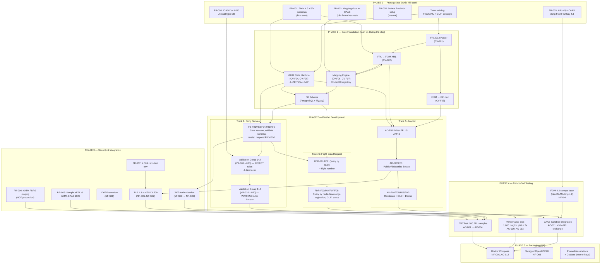
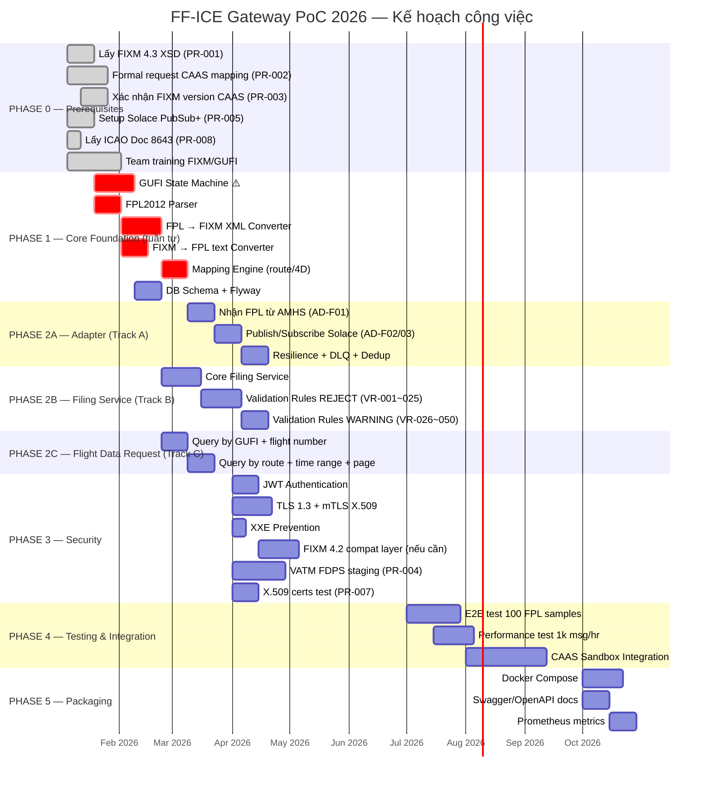

Dưới đây là phân tích đầy đủ về thứ tự và quan hệ phụ thuộc giữa các công việc.

---

## 1. Sơ đồ phụ thuộc — Cái gì chặn cái gì

---

## 2. Gantt theo Quý

---

## 3. Phân tích quan trọng — Quyết định về thứ tự

### 🔴 Phải làm tuần tự (không thể đảo)

| Thứ tự | Lý do |
|--------|-------|
| Prerequisites → tất cả code | Không có XSD thì không thể viết converter |
| GUFI State Machine → Filing Service | Filing Service dùng state machine để chuyển FILED→ACCEPTED |
| FPL Parser → FPL→FIXM → Mapping Engine | Phụ thuộc kỹ thuật rõ ràng |
| DB Schema → Filing + Flight Data Request | Cả hai service cùng dùng DB |
| Filing Service lưu dữ liệu → Flight Data Request query | FDR không có gì để query nếu Filing chưa persist |
| Security (TLS + JWT) → CAAS integration | CAAS sẽ từ chối kết nối không có mTLS |

### 🟢 Có thể làm song song sau Phase 1

| Track A | Track B | Track C |
|---------|---------|---------|
| Adapter (AMHS/Solace) | Filing Service + Validation Rules | Flight Data Request Service |
| Độc lập về interface | Dùng chung DB schema | Dùng chung DB schema |

**Lưu ý quan trọng nhất:** Track B và Track C **chia sẻ DB schema** — cần thống nhất data model trước khi tách team làm song song, nếu không sẽ conflict migration.

### ⚠️ 3 rủi ro thứ tự hay bị bỏ sót

1. **GUFI State Machine** (RSK-005) — tài liệu chỉ rõ đây là *critical gap*. Nếu để cuối Q2 mới làm thì Filing Service đã được code sai ngay từ đầu — phải **refactor toàn bộ**.

2. **FIXM version của CAAS** (RSK-001) — nếu Q3 mới biết CAAS dùng 4.2, thì phải build compat layer gấp trong khi đang integration test — cực kỳ tốn thời gian. Xác nhận **trước khi code Q1**.

3. **Validation Rules: REJECT trước, WARNING sau** (RSK-006) — 15 REJECT rules là điều kiện để Filing Service "chạy được", 35 WARNING rules là refinement. Làm song song sẽ phân tán effort.
