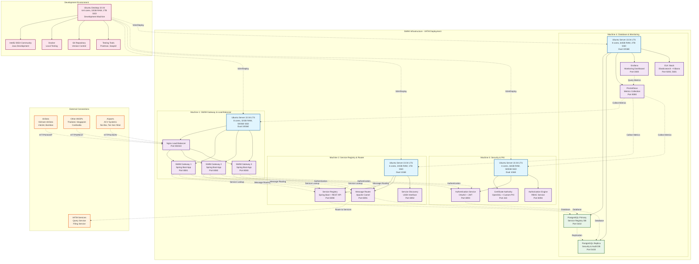
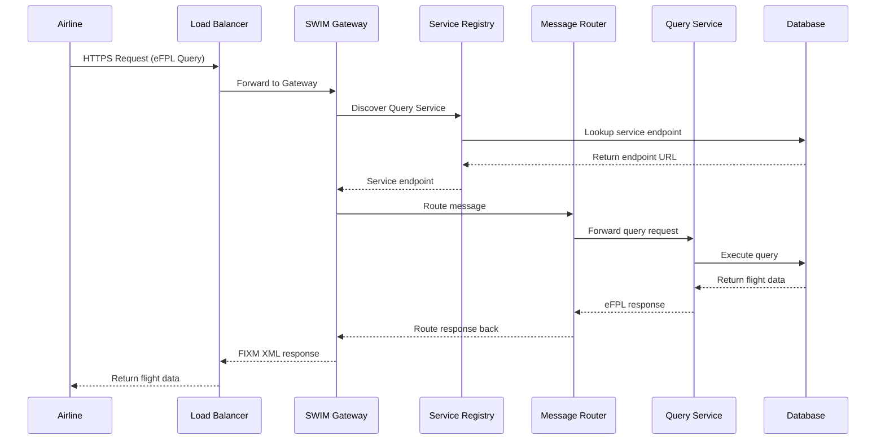
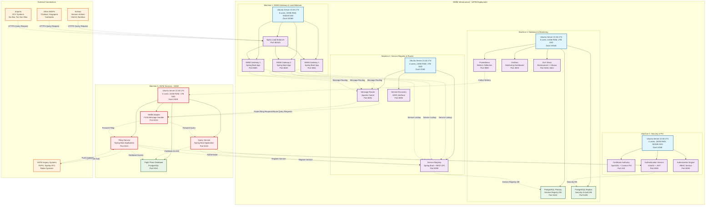
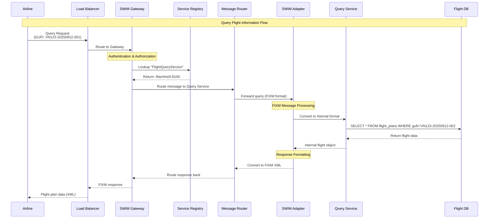

**KHÔNG ĐÚNG!** SWIM không phải VPN đơn thuần. Đây là hiểu lầm rất phổ biến. Để tôi giải thích rõ:

## **SWIM INFRASTRUCTURE LÀ GÌ:**

### **SWIM ≠ VPN:**
```
VPN:
- Chỉ là "tunnel" mã hóa
- Point-to-point connection
- Không có business logic
- Chỉ transport layer

SWIM:
- Service-oriented architecture  
- Message routing & transformation
- Business rule enforcement
- Service discovery & registry
- Security + routing + logic
```

### **SWIM là "Internet cho hàng không":**
```
Giống như Internet:
- Multiple nodes kết nối với nhau
- Standardized protocols (HTTP, SOAP, REST)
- Service discovery (như DNS)
- Message routing (như routers)
- Security certificates (như HTTPS)

Nhưng specific cho aviation:
- FIXM message format
- Flight plan routing rules
- Aviation security standards
- Regulatory compliance
```

## **TẠI SAO CẦN SWIM CHO QUERY SERVICE:**

### **Không có SWIM:**
```
❌ Airlines gọi trực tiếp VATM server
❌ Point-to-point connections everywhere  
❌ Mỗi airline cần riêng protocol
❌ Không tương thích với FF-ICE standard
❌ Không kết nối được với ANSPs khác
```

### **Có SWIM:**
```
✅ Standardized message exchange
✅ Airlines connect qua SWIM infrastructure
✅ Automatic routing tới đúng services
✅ Compatible với international systems
✅ Security & authentication tự động
```

## **SWIM ARCHITECTURE:**

### **SWIM Network Structure:**
```
┌─────────────────────────────────────────────────┐
│                SWIM Network                     │
│  ┌───────────────┬─────────────┬─────────────┐  │
│  │ Service       │ Message     │ Security    │  │  
│  │ Registry      │ Router      │ Manager     │  │
│  └───────────────┴─────────────┴─────────────┘  │
│         ↕              ↕              ↕         │
│  ┌─────────┬──────────┬──────────┬──────────┐   │
│  │ VATM    │Airlines  │Other     │Airports  │   │
│  │Services │          │ANSPs     │          │   │
│  └─────────┴──────────┴──────────┴──────────┘   │
└─────────────────────────────────────────────────┘
```

### **SWIM Components:**
```
1. Service Registry:
   - Discover available services
   - Service descriptions (WSDL)
   - Endpoint URLs

2. Message Router:  
   - Route messages to correct services
   - Transform message formats
   - Handle errors & retries

3. Security Infrastructure:
   - PKI certificates
   - Authentication & authorization
   - Message encryption

4. Monitoring & Management:
   - Service health monitoring
   - Performance metrics
   - Audit logging
```

## **QUAN HỆ VỚI QUERY SERVICE:**

### **Query Service cần SWIM để:**

#### **1. Receive requests:**
```
Thay vì:
Airline → Direct call → VATM Query Service

Có SWIM:
Airline → SWIM → Message routing → VATM Query Service
```

#### **2. Service discovery:**
```
Airlines không cần biết:
- VATM server IP address
- Authentication details  
- Message formats

SWIM handles:
- Service lookup
- Automatic routing
- Format conversion
```

#### **3. Security:**
```
SWIM provides:
- Certificate-based authentication
- Message encryption
- Access control
- Audit trails
```

## **TRIỂN KHAI THỰC TẾ CHO VATM:**

### **Option 1: Full SWIM Implementation**
```
VATM builds complete SWIM infrastructure:
- Service registry server
- Message routing server
- Security infrastructure
- Monitoring systems

Cost: $500K-1M
Timeline: 12-18 months
```

### **Option 2: Connect to existing SWIM**
```
VATM joins regional SWIM network:
- Connect tới ASEAN SWIM infrastructure
- Use existing SWIM services
- Focus on Query Service development

Cost: $50K-100K connection fees
Timeline: 3-6 months
```

### **Option 3: SWIM-compatible (Recommended):**
```
Build Query Service SWIM-compatible:
- Implement SWIM protocols
- Support FIXM messaging  
- Certificate-based security
- Can connect to SWIM later

Cost: $10K-20K extra development
Timeline: +1-2 months
```

## ** SWIM:**

### **" thực hiện SWIM test environment"**
```
Có nghĩa là:
✅ VATM đã có SWIM infrastructure cơ bản
✅ Test environment đã sẵn sàng
✅ Query Service có thể connect ngay

→ Bạn KHÔNG cần build SWIM from scratch!
```

### **Cần làm gì:**
```
1. Tìm hiểu SWIM setup của anh Đức
2. Query Service connect tới SWIM test environment
3. Test message exchange qua SWIM
4. Verify FIXM compatibility
```

## **TIMELINE VỚI SWIM:**

### **Development với SWIM integration:**
```
Month 1: Basic Query Service (standalone)
Month 2: SWIM integration development
Month 3: Testing với SWIM environment
Month 4: Production deployment qua SWIM
```

### **Additional work needed:**
```
SWIM Client Library:
- SOAP/REST client for SWIM services
- Certificate management
- Message formatting
- Error handling

Estimate: +2-4 weeks development
```

## **RECOMMENDATION:**

### **Approach:**
```
1. Build Query Service standalone first
2. Add SWIM integration layer
3. Test với SWIM environment
4. Deploy production với SWIM connectivity

Benefits:
✅ Can test Query Service independently  
✅ SWIM integration is additional layer
✅ Reuse existing SWIM infrastructure
✅ Compatible với FF-ICE standards
```

**KẾT LUẬN:** 
- SWIM ≠ VPN, it's much more complex
- Nhưng anh Đức đã setup → bạn chỉ cần integrate
- Query Service + SWIM integration = 1-2 tháng extra work
- Absolutely necessary cho FF-ICE compliance


**TỐT!** Tự làm SWIM sẽ hiểu sâu hơn và kiểm soát tốt hơn. Để tôi hướng dẫn bạn build SWIM infrastructure từ đầu:

## **SWIM ARCHITECTURE - TECHNICAL DEEP DIVE:**

### **SWIM Core Components:**

#### **1. Service Registry (Như DNS cho services):**
```
Function:
- Store service descriptions (WSDL files)
- Service endpoint URLs  
- Service capabilities & interfaces
- Health status của services

Implementation:
- UDDI (Universal Description, Discovery, Integration)
- Hoặc custom REST-based registry
- Database: PostgreSQL để store service metadata
```

#### **2. Message Router/ESB (Enterprise Service Bus):**
```
Function:
- Route messages between services
- Transform message formats
- Handle retry logic
- Load balancing

Options:
- Apache Camel (Open source)
- Apache ServiceMix
- Mule CE (Community Edition)
- Custom Spring Boot router
```

#### **3. Security Infrastructure:**
```
Components:
- Certificate Authority (CA)
- PKI management
- Authentication service
- Authorization engine

Implementation:
- OpenSSL for CA
- LDAP/Active Directory for users
- OAuth2/JWT for tokens
```

## **SWIM MINIMAL IMPLEMENTATION:**

### **Phase 1: Basic SWIM Node (2-3 tháng)**

#### **Component 1: Service Registry**
```java
// Simple REST-based service registry
@RestController
public class ServiceRegistryController {
    
    @PostMapping("/registry/register")
    public void registerService(@RequestBody ServiceDescriptor service) {
        // Store service info in database
        serviceRepository.save(service);
    }
    
    @GetMapping("/registry/discover/{serviceType}")
    public List<ServiceDescriptor> discoverServices(@PathVariable String serviceType) {
        // Return matching services
        return serviceRepository.findByType(serviceType);
    }
}

// Database schema
CREATE TABLE service_registry (
    id SERIAL PRIMARY KEY,
    service_name VARCHAR(255),
    service_type VARCHAR(100),
    endpoint_url VARCHAR(500),
    wsdl_url VARCHAR(500),
    status VARCHAR(50),
    last_heartbeat TIMESTAMP
);
```

#### **Component 2: Message Router**
```java
// Simple message router với Apache Camel
@Component
public class SWIMMessageRouter extends RouteBuilder {
    
    @Override
    public void configure() throws Exception {
        
        // Route flight plan queries
        from("rest:get:/swim/query/flight/{gufi}")
            .to("bean:serviceDiscovery?method=findQueryService")
            .to("http://query-service/api/flight/${header.gufi}");
            
        // Route filing requests  
        from("rest:post:/swim/filing/submit")
            .to("bean:serviceDiscovery?method=findFilingService")
            .to("http://filing-service/api/submit");
    }
}
```

#### **Component 3: Security Manager**
```java
// Certificate-based authentication
@Component
public class SWIMSecurityManager {
    
    public boolean authenticateClient(X509Certificate clientCert) {
        // Validate certificate against CA
        return certificateValidator.isValid(clientCert);
    }
    
    public boolean authorizeRequest(String clientId, String serviceType) {
        // Check permissions in database
        return permissionRepository.hasAccess(clientId, serviceType);
    }
}
```

## **SWIM DEPLOYMENT ARCHITECTURE:**

### **3-Tier Architecture:**
```
┌─────────────────────────────────────────────────┐
│                 SWIM Layer                      │
├─────────────────────────────────────────────────┤
│  Load Balancer (Nginx)                         │
│  ├── SWIM Gateway 1                            │
│  ├── SWIM Gateway 2                            │
│  └── SWIM Gateway 3                            │
├─────────────────────────────────────────────────┤
│  Service Layer                                  │
│  ├── Service Registry                          │
│  ├── Message Router                            │
│  ├── Security Manager                          │
│  └── Monitoring Service                        │
├─────────────────────────────────────────────────┤
│  Data Layer                                     │
│  ├── Service Registry DB                       │
│  ├── Security Credentials DB                   │
│  ├── Audit Logs DB                             │
│  └── Configuration DB                          │
└─────────────────────────────────────────────────┘
```

## **HARDWARE REQUIREMENTS CHO SWIM:**

### **Production SWIM Infrastructure (4 máy Ubuntu):**

#### **Machine 1: SWIM Gateway & Load Balancer**
```
Ubuntu Server 22.04 LTS
CPU: 8 cores (Intel Xeon hoặc AMD EPYC)
RAM: 32GB DDR4 ECC
Storage: 500GB NVMe SSD  
Network: Dual 10GbE
Role: Nginx LB + SWIM gateways
```

#### **Machine 2: Service Registry & Router**
```
Ubuntu Server 22.04 LTS  
CPU: 6 cores
RAM: 24GB DDR4 ECC
Storage: 1TB SSD
Network: Dual 1GbE
Role: Service discovery + message routing
```

#### **Machine 3: Security & PKI Infrastructure**
```
Ubuntu Server 22.04 LTS
CPU: 4 cores  
RAM: 16GB DDR4 ECC
Storage: 500GB SSD (encrypted)
Network: Dual 1GbE
Role: CA, authentication, certificates
```

#### **Machine 4: Database & Monitoring**
```
Ubuntu Server 22.04 LTS
CPU: 8 cores
RAM: 64GB DDR4 ECC  
Storage: 2TB NVMe SSD + 8TB HDD
Network: Dual 10GbE
Role: PostgreSQL cluster + monitoring
```

### **Development Environment (1 máy):**
```
Ubuntu Desktop 22.04 LTS
CPU: 6-8 cores
RAM: 32GB
Storage: 1TB SSD
Role: Development + testing all components
```

## **SOFTWARE STACK (100% FREE):**

### **SWIM Infrastructure Software:**
```
Operating System: Ubuntu Server 22.04 LTS
Load Balancer: Nginx
Application Runtime: OpenJDK 17
Framework: Spring Boot 3.x
Message Router: Apache Camel 4.x
Service Registry: Custom REST + PostgreSQL
Database: PostgreSQL 15
Monitoring: Prometheus + Grafana
Logging: ELK Stack (Elasticsearch, Logstash, Kibana)
Security: OpenSSL + custom PKI
```

### **Development Tools:**
```
IDE: IntelliJ IDEA Community
Version Control: Git
Build Tool: Maven/Gradle
Testing: JUnit, Postman, SoapUI
Documentation: Swagger/OpenAPI
```

## **IMPLEMENTATION TIMELINE:**

### **Month 1-2: Core Infrastructure**
```
Week 1-2: Setup hardware + Ubuntu installation
Week 3-4: Basic service registry development
Week 5-6: Message router implementation  
Week 7-8: Security infrastructure setup
```

### **Month 3-4: Integration & Testing**
```
Week 9-10: Component integration
Week 11-12: Security testing
Week 13-14: Performance testing
Week 15-16: Documentation + training
```

### **Month 5-6: Production Deployment**
```
Week 17-18: Production environment setup
Week 19-20: Service deployment
Week 21-22: Integration testing với Query Service
Week 23-24: Go-live preparation
```

## **DEVELOPMENT APPROACH:**

### **Start Simple, Scale Up:**

#### **Phase 1: Minimal SWIM (1 machine)**
```
Single Ubuntu server:
- Service registry (REST API)
- Basic message routing
- Simple authentication
- PostgreSQL database

Proof of concept trong 1 tháng
```

#### **Phase 2: Production SWIM (4 machines)**
```
Distribute components:
- High availability
- Load balancing  
- Security hardening
- Performance optimization
```

#### **Phase 3: Advanced Features**
```
- Cross-border connectivity
- Advanced routing rules
- Real-time monitoring
- Disaster recovery
```

## **TESTING STRATEGY:**

### **Unit Testing:**
```
- Service registry operations
- Message routing logic
- Security validation
- Database operations
```

### **Integration Testing:**
```
- End-to-end message flow
- Service discovery workflow
- Certificate authentication
- Error handling scenarios
```

### **Performance Testing:**
```
- Message throughput (target: 1000 msg/sec)
- Service discovery latency
- Database query performance
- Network bandwidth utilization
```

## **BUDGET ESTIMATE:**

### **Hardware (nếu mua mới):**
```
4 production servers: $15K-25K
1 development machine: $3K-5K
Network equipment: $5K-10K
UPS & cooling: $3K-5K

Total hardware: $26K-45K
```

### **Software:**
```
All open source: $0
Professional support (optional): $10K-20K/year
```

### **Human Resources:**
```
SWIM development team: 3-4 engineers × 6 months
Estimated cost: $100K-150K
```

**TOTAL PROJECT: $126K-195K** (so với mua commercial SWIM solution: $500K-1M)

## **NEXT STEPS:**

### **Week 1-2: Planning**
```
1. Finalize hardware procurement
2. Setup development environment  
3. Create detailed technical design
4. Setup project repository
```

### **Week 3-4: Foundation**
```
1. Install Ubuntu on all machines
2. Setup basic networking
3. Create service registry skeleton
4. Setup CI/CD pipeline
```

**Bạn sẵn sàng bắt đầu với approach này không? Tôi có thể detail từng component implementation.**


## **SOFTWARE DETAILS CHO TỪNG MÁY:**

### **Machine 1: SWIM Gateway & Load Balancer**
```bash
# Services running:
sudo systemctl status nginx          # Load balancer
sudo systemctl status swim-gateway-1 # Spring Boot app
sudo systemctl status swim-gateway-2 # Spring Boot app  
sudo systemctl status swim-gateway-3 # Spring Boot app

# Ports:
netstat -tlnp | grep :80    # Nginx HTTP
netstat -tlnp | grep :443   # Nginx HTTPS
netstat -tlnp | grep :8081  # Gateway 1
netstat -tlnp | grep :8082  # Gateway 2
netstat -tlnp | grep :8083  # Gateway 3
```

### **Machine 2: Service Registry & Router**
```bash
# Services running:
sudo systemctl status service-registry  # REST API
sudo systemctl status message-router    # Apache Camel
sudo systemctl status service-discovery # UDDI

# Ports:
netstat -tlnp | grep :8090  # Service Registry
netstat -tlnp | grep :8091  # Message Router
netstat -tlnp | grep :8092  # Service Discovery
```

### **Machine 3: Security & PKI**
```bash
# Services running:
sudo systemctl status openssl-ca        # Certificate Authority
sudo systemctl status oauth2-server     # Authentication
sudo systemctl status authz-engine      # Authorization

# Ports:
netstat -tlnp | grep :443   # CA HTTPS
netstat -tlnp | grep :8093  # OAuth2 server
netstat -tlnp | grep :8094  # Authorization engine
```

### **Machine 4: Database & Monitoring**
```bash
# Services running:
sudo systemctl status postgresql         # Primary DB
sudo systemctl status postgresql@replica # Replica DB
sudo systemctl status prometheus         # Metrics
sudo systemctl status grafana-server     # Dashboard
sudo systemctl status elasticsearch      # Log search
sudo systemctl status kibana             # Log visualization

# Ports:
netstat -tlnp | grep :5432  # PostgreSQL primary
netstat -tlnp | grep :5433  # PostgreSQL replica
netstat -tlnp | grep :9090  # Prometheus
netstat -tlnp | grep :3000  # Grafana
netstat -tlnp | grep :9200  # Elasticsearch
netstat -tlnp | grep :5601  # Kibana
```

## **NETWORK FLOW:**



## **INSTALLATION COMMANDS:**

### **Machine 1 Setup:**
```bash
# Install Nginx
sudo apt update
sudo apt install nginx -y

# Install Java
sudo apt install openjdk-17-jdk -y

# Setup SWIM Gateway applications
mkdir -p /opt/swim/gateway
# Deploy Spring Boot JARs
sudo systemctl enable swim-gateway-1
sudo systemctl enable swim-gateway-2
sudo systemctl enable swim-gateway-3
```

### **Machine 2 Setup:**
```bash
# Install Java and Maven
sudo apt install openjdk-17-jdk maven -y

# Install Apache Camel
mkdir -p /opt/swim/router
# Deploy message router application
sudo systemctl enable service-registry
sudo systemctl enable message-router
```

### **Machine 3 Setup:**
```bash
# Install OpenSSL and security tools
sudo apt install openssl ca-certificates -y

# Setup PKI infrastructure
mkdir -p /opt/swim/pki/{ca,certs,private}
# Configure CA and security services
sudo systemctl enable openssl-ca
sudo systemctl enable oauth2-server
```

### **Machine 4 Setup:**
```bash
# Install PostgreSQL
sudo apt install postgresql-15 postgresql-client-15 -y

# Install monitoring stack
sudo apt install prometheus grafana -y

# Install ELK stack
wget -qO - https://artifacts.elastic.co/GPG-KEY-elasticsearch | sudo apt-key add -
sudo apt install elasticsearch kibana -y
```

**Bạn muốn tôi detail implementation code cho component nào trước?**
Tuyệt! Để tôi bổ sung Query Service vào SWIM architecture:



## **VỊ TRÍ QUERY SERVICE TRONG SWIM:**

### **Query Service là "Business Logic Layer":**
```
SWIM Infrastructure (Machines 1-4):
├── Transport & Security (gateways, auth)
├── Service Discovery & Routing
└── Monitoring & Management

VATM Services (Machine 5):
├── Query Service ← ĐÂY LÀ CORE BUSINESS LOGIC
├── Filing Service  
└── SWIM Adapter ← Interface với SWIM
```

### **Message Flow cho Query Service:**



## **QUERY SERVICE CHI TIẾT:**

### **Machine 5 Configuration:**
```bash
# Services running on Machine 5:
sudo systemctl status query-service     # Port 8100
sudo systemctl status filing-service    # Port 8101  
sudo systemctl status swim-adapter      # Port 8102
sudo systemctl status postgresql        # Port 5434

# Directory structure:
/opt/vatm/
├── query-service/
│   ├── query-service.jar
│   ├── application.yml
│   └── logs/
├── filing-service/
│   ├── filing-service.jar
│   └── logs/
├── swim-adapter/
│   ├── swim-adapter.jar
│   └── fixm-schemas/
└── database/
    └── flight-plans/
```

### **Query Service Code Structure:**
```java
// Main Application
@SpringBootApplication
@EnableJpaRepositories
public class QueryServiceApplication {
    public static void main(String[] args) {
        SpringApplication.run(QueryServiceApplication.class, args);
    }
}

// REST Controller - Internal API  
@RestController
@RequestMapping("/api/query")
public class QueryController {
    
    @GetMapping("/flight/{gufi}")
    public ResponseEntity<FlightPlan> getFlightByGufi(@PathVariable String gufi) {
        FlightPlan flight = queryService.findByGufi(gufi);
        return ResponseEntity.ok(flight);
    }
    
    @GetMapping("/search")
    public ResponseEntity<List<FlightPlan>> searchFlights(
            @RequestParam String flightNumber,
            @RequestParam LocalDate date) {
        List<FlightPlan> flights = queryService.searchFlights(flightNumber, date);
        return ResponseEntity.ok(flights);
    }
}
```

### **SWIM Adapter Code:**
```java
// SWIM Interface - FIXM Handler
@RestController
@RequestMapping("/swim")
public class SWIMAdapterController {
    
    @Autowired
    private QueryServiceClient queryServiceClient;
    
    @Autowired  
    private FIXMConverter fixmConverter;
    
    @PostMapping("/query")
    public ResponseEntity<String> handleSWIMQuery(@RequestBody String fixmQuery) {
        try {
            // 1. Parse FIXM query
            QueryRequest request = fixmConverter.parseQuery(fixmQuery);
            
            // 2. Call internal Query Service
            FlightPlan flight = queryServiceClient.getFlightByGufi(request.getGufi());
            
            // 3. Convert to FIXM response
            String fixmResponse = fixmConverter.toFIXM(flight);
            
            return ResponseEntity.ok(fixmResponse);
            
        } catch (Exception e) {
            return ResponseEntity.badRequest().body("Error: " + e.getMessage());
        }
    }
}
```

## **SERVICE REGISTRATION:**

### **Query Service tự đăng ký với SWIM:**
```java
@Component
public class ServiceRegistration {
    
    @Value("${swim.registry.url}")
    private String registryUrl;
    
    @PostConstruct
    public void registerWithSWIM() {
        ServiceDescriptor descriptor = new ServiceDescriptor();
        descriptor.setServiceName("VATM-FlightQueryService");
        descriptor.setServiceType("FF-ICE-Query");
        descriptor.setEndpointUrl("http://machine5:8102/swim/query");
        descriptor.setWsdlUrl("http://machine5:8102/swim/query?wsdl");
        descriptor.setProvider("VATM");
        descriptor.setVersion("1.0");
        
        // Register với Service Registry
        restTemplate.postForObject(registryUrl + "/register", descriptor, String.class);
    }
}
```

## **DATABASE SCHEMA CHO QUERY SERVICE:**

```sql
-- Machine 5 PostgreSQL Database
CREATE DATABASE vatm_flight_plans;

CREATE TABLE flight_plans (
    id SERIAL PRIMARY KEY,
    gufi VARCHAR(50) UNIQUE NOT NULL,
    flight_number VARCHAR(10) NOT NULL,
    aircraft_type VARCHAR(10),
    departure_airport VARCHAR(4),
    arrival_airport VARCHAR(4),
    departure_time TIMESTAMP,
    arrival_time TIMESTAMP,
    route TEXT,
    altitude INTEGER,
    speed INTEGER,
    fixm_data JSONB,  -- Store complete FIXM as JSON
    created_at TIMESTAMP DEFAULT NOW(),
    updated_at TIMESTAMP DEFAULT NOW()
);

-- Indexes for fast querying
CREATE INDEX idx_gufi ON flight_plans(gufi);
CREATE INDEX idx_flight_number_date ON flight_plans(flight_number, DATE(departure_time));
CREATE INDEX idx_route ON flight_plans(departure_airport, arrival_airport);
CREATE INDEX idx_departure_time ON flight_plans(departure_time);
```

## **CONFIGURATION FILES:**

### **Query Service application.yml:**
```yaml
server:
  port: 8100

spring:
  datasource:
    url: jdbc:postgresql://localhost:5434/vatm_flight_plans
    username: query_user
    password: secure_password
  jpa:
    hibernate:
      ddl-auto: update
    show-sql: false

swim:
  registry:
    url: http://machine2:8090/registry
  adapter:
    url: http://localhost:8102
  
logging:
  level:
    com.vatm.queryservice: DEBUG
```

**TÓM LẠI VỊ TRÍ QUERY SERVICE:**
- ✅ **Machine 5**: Riêng biệt với SWIM infrastructure
- ✅ **Port 8100**: Internal business logic API
- ✅ **SWIM Adapter**: Interface với SWIM (port 8102)  
- ✅ **Auto-registration**: Tự đăng ký với Service Registry
- ✅ **Independent**: Có thể develop/test độc lập

**Query Service chạy như 1 microservice riêng, connect tới SWIM qua standardized interfaces!**
