```mermaid
sequenceDiagram
    autonumber
    participant User as 🧑‍✈️ Airline Dispatcher (User)
    participant API as 🛰️ Filing Service API (REST)
    participant Validator as 🧩 FIXM Validator
    participant Rules as ⚙️ Rule Engine
    participant DB as 🗄️ Database (flight_plans & validation_log)
    participant Resp as 📩 ACK/NACK Generator

    %% User sends request
    User->>API: POST /api/v1/filing/submit\nwith test_fixm.xml (JSON)
    API->>DB: Insert initial log (status=PENDING)
    
    %% FIXM Validation
    API->>Validator: Validate XML schema (fixm.xsd)
    Validator-->>API: ✅ Valid / ❌ Invalid

    %% Business Rules
    API->>Rules: Check ICAO codes, ETD<ETA, flightNumber
    Rules-->>API: ✅ OK / ❌ Rule violation

    %% Decision branch
    alt XML or Business Invalid
        API->>DB: Update validation_log (status=REJECTED)
        API->>Resp: Generate NACK JSON
        Resp-->>User: HTTP 400\n{"status":"REJECTED", "message":"Invalid FIXM XML"}
    else All valid
        API->>DB: Insert flight_plan (status=FILED)
        API->>DB: Update validation_log (status=ACCEPTED)
        API->>Resp: Generate ACK JSON
        Resp-->>User: HTTP 200\n{"status":"ACCEPTED","gufi":"VN123-..."}
    end

    %% Optional follow-up
    User->>API: GET /api/v1/filing/{gufi}
    API->>DB: Fetch flight_plan
    DB-->>User: FlightPlan details (JSON)
```

Rất hay 👨‍✈️ — đúng trọng tâm câu hỏi của một **người dùng vận hành (Airline Dispatcher / Filer)** trong hệ thống FF-ICE Filing Service.
Ta tạm **rời vai nhà phát triển**, và xem Filing Service hoạt động **từ phía người sử dụng**.
Giờ bạn có tệp `test_fixm.xml` (điện văn eFPL) rồi — hãy xem hành trình của nó **bên trong hệ thống** theo đúng luồng ICAO chuẩn.

---

## 🧭 **1️⃣ Vai trò người dùng và mục tiêu**

Bạn là **người nộp kế hoạch bay điện tử (eFPL)** — ví dụ: hãng hàng không, trung tâm OCC, hoặc một ATC local tester.

Nhiệm vụ của bạn:

> Gửi điện văn FIXM (XML) chứa kế hoạch bay tới Filing Service,
> nhận về phản hồi **ACK (ACCEPTED)** hoặc **NACK (REJECTED)**.

---

## ⚙️ **2️⃣ Cách nạp điện văn test_fixm.xml**

Giả sử file XML của bạn nằm trong thư mục:

```
~/filing-service/test_fixm.xml
```

Bạn gửi lên hệ thống bằng lệnh:

```bash
curl -X POST http://localhost:8080/api/v1/filing/submit \
  -H "Content-Type: application/json" \
  -d @<(cat <<EOF
{
  "flightNumber": "VN123",
  "departure": "VVNB",
  "arrival": "VVTS",
  "etd": "2025-10-09T02:00:00",
  "eta": "2025-10-09T04:00:00",
  "fixmXml": "$(tr -d '\n' < test_fixm.xml)"
}
EOF
)
```

> Hệ thống không đọc file trực tiếp, mà bạn **nạp nội dung XML** vào trường `"fixmXml"`.
> (Trong thực tế, SWIM Gateway sẽ gửi XML gốc qua SOAP, nhưng trong bản stand-alone này ta dùng REST/JSON cho dễ test.)

---

## 🔁 **3️⃣ Hệ thống xử lý điện văn theo 7 bước nội bộ**

### 🧩 Bước 1. **Tiếp nhận và ghi log ban đầu**

* API `/filing/submit` nhận payload.
* Lưu **raw XML** và metadata (flightNumber, departure, arrival, timestamp) vào bảng `validation_log` với trạng thái **PENDING**.
* Sinh GUFI (Global Unique Flight Identifier).

📘 *Ví dụ trong DB:*

```
gufi=7b6d-...-aa12
raw_request=<FlightPlan>...</FlightPlan>
received_at=2025-10-09T01:00:02Z
status=PENDING
```

---

### 🧠 Bước 2. **Kiểm tra hợp lệ FIXM (XML Schema Validation)**

* Module `FixmValidator` tải file `fixm.xsd` từ `src/main/resources/schema/fixm_4_2_0/`.
* Parser kiểm tra cấu trúc XML: tag mở/đóng, namespace, kiểu dữ liệu, định dạng thời gian, v.v.

🧩 Nếu XML **đúng schema** → pass ✅
🧩 Nếu **sai tag hoặc namespace** → **NACK**, ghi lỗi “Invalid FIXM XML”.

📘 *Ví dụ log:*

```
fixm_is_valid=false
validation_message="Missing element 'departure'"
```

---

### 🧮 Bước 3. **Kiểm tra nghiệp vụ (Rule Engine)**

Chạy lần lượt các quy tắc:

1. Departure và Arrival có đúng định dạng ICAO `[A-Z]{4}` không?
2. Flight number hợp lệ? (VD: `VN123`, `VJ5120`)
3. ETD < ETA?
4. Có trùng GUFI không?

Nếu bất kỳ rule nào sai → REJECTED, ghi nguyên nhân.

📘 *Ví dụ log:*

```
business_is_valid=false
validation_message="ETD must be before ETA"
```

---

### 📂 Bước 4. **Lưu dữ liệu hợp lệ vào CSDL**

Nếu vượt qua cả FIXM + Rule Engine:

* Sinh GUFI (UUID)
* Tạo bản ghi mới trong bảng `flight_plans`
* Ghi status = “FILED”

📘 *Ví dụ trong DB:*

```sql
SELECT gufi, flight_number, status FROM flight_plans;
-- 7b6d... | VN123 | FILED
```

---

### 📨 Bước 5. **Sinh thông điệp phản hồi (ACK/NACK)**

Tạo bản tin phản hồi theo cấu trúc ICAO-like (simplified JSON hoặc XML).

**ACK (Accepted):**

```json
{
  "gufi": "7b6d-...-aa12",
  "status": "ACCEPTED",
  "message": "Flight plan filed successfully",
  "timestamp": "2025-10-09T01:00:03Z"
}
```

**NACK (Rejected):**

```json
{
  "status": "REJECTED",
  "message": "Invalid FIXM XML: Missing element 'arrival'",
  "timestamp": "2025-10-09T01:00:02Z"
}
```

---

### 📜 Bước 6. **Ghi log kết quả**

Cập nhật bảng `validation_log`:

```
validation_status=ACCEPTED
validation_message="Flight Plan accepted"
fixm_is_valid=true
business_is_valid=true
```

---

### 📡 Bước 7. **Trả ACK/NACK cho người dùng**

Phản hồi HTTP 200 (OK) hoặc 400 (Bad Request).
Đây là bản tin **tương đương “Filing Acknowledgement” trong SWIM**.

Trên Postman hoặc curl bạn thấy ngay kết quả:

```
{
  "gufi": "7b6d-...-aa12",
  "status": "ACCEPTED"
}
```

---

## 🧭 **4️⃣ Trạng thái điện văn sau khi xử lý**

| Trạng thái    | Ý nghĩa                                           |
| ------------- | ------------------------------------------------- |
| **FILED**     | Kế hoạch bay hợp lệ, đã lưu vào hệ thống.         |
| **REJECTED**  | Kế hoạch bay sai (cấu trúc hoặc nghiệp vụ).       |
| **PENDING**   | Mới nhận, đang chờ xử lý (trường hợp SWIM async). |
| **CANCELLED** | (Dành cho giai đoạn sau, khi nộp FPL huỷ).        |

Bạn có thể xem bằng lệnh:

```bash
psql -U filing_user -d filing_db -c "SELECT gufi, flight_number, status FROM flight_plans;"
```

---

## 🔍 **5️⃣ Truy xuất lại kế hoạch bay**

Sau khi filing thành công:

```bash
curl http://localhost:8080/api/v1/filing/7b6d-...-aa12
```

→ Nhận lại toàn bộ nội dung FPL đã nộp.

---

## 📊 **6️⃣ Xem lịch sử xử lý (Validation Log)**

```bash
curl http://localhost:8080/api/v1/filing/logs
```

→ Kết quả:

```json
[
  {
    "gufi": "7b6d-...-aa12",
    "validationStatus": "ACCEPTED",
    "validationMessage": "Flight plan filed successfully",
    "fixmIsValid": true,
    "businessIsValid": true,
    "receivedAt": "2025-10-09T01:00:02Z"
  }
]
```

---

## 🧩 **7️⃣ Trong SWIM thực tế (sau này)**

Ở giai đoạn FF-ICE/SWIM:

* Thay vì gửi JSON, bạn sẽ gửi **SOAP XML điện văn eFPL**.
* Filing Service của bạn trở thành **SOAP endpoint** (ví dụ: `FilingService.wsdl`).
* Hệ thống sẽ tự động sinh **ACK/NACK XML** trả về qua SWIM Gateway.
* Cả hai bản tin sẽ có **X.509 signature + timestamp** để bảo đảm tính toàn vẹn.

---

## ✅ **Tóm tắt từ góc người dùng:**

| Giai đoạn           | Mô tả                            | Bạn thấy gì                      |
| ------------------- | -------------------------------- | -------------------------------- |
| 1️⃣ Gửi điện văn    | Nạp `test_fixm.xml` qua REST API | Postman/curl gửi JSON            |
| 2️⃣ FIXM Validation | Hệ thống kiểm tra XML            | Lỗi cấu trúc nếu sai             |
| 3️⃣ Rule Engine     | Kiểm tra nghiệp vụ               | Cảnh báo logic nếu sai           |
| 4️⃣ Ghi DB          | Lưu eFPL + GUFI                  | Lưu trạng thái FILED             |
| 5️⃣ ACK/NACK        | Trả phản hồi                     | JSON thông báo ACCEPTED/REJECTED |
| 6️⃣ Log             | Lưu validation log               | Có thể xem lại lịch sử           |

---

📘 **Tóm lại:**

> ✅ Bạn có thể nạp `test_fixm.xml` ngay bây giờ.
> Hệ thống sẽ đọc, validate, kiểm tra logic, lưu vào DB và trả về **ACK/NACK** — đúng như ICAO FF-ICE yêu cầu cho Filing Service.

---

Bạn có muốn tôi minh họa **toàn bộ quy trình xử lý test_fixm.xml** này bằng một **sequence diagram (sơ đồ tuần tự)** để bạn dùng trong tài liệu vận hành không?

Xuất sắc 👨‍✈️ — dưới đây là **Mermaid sequence diagram** mô phỏng **quy trình xử lý điện văn eFPL (test_fixm.xml)** trong Filing Service của bạn,
đứng từ **góc nhìn người dùng (Airline Dispatcher)** gửi kế hoạch bay đến **hệ thống FF-ICE Filing Service (stand-alone)**.

---



---

### 📘 Giải thích luồng

| # | Giai đoạn               | Mô tả chi tiết                                                          |
| - | ----------------------- | ----------------------------------------------------------------------- |
| 1 | **User gửi điện văn**   | Bạn gửi `test_fixm.xml` chứa eFPL qua REST API.                         |
| 2 | **Hệ thống ghi log**    | Filing Service ghi bản ghi `validation_log` với status PENDING.         |
| 3 | **Kiểm tra FIXM**       | Xác thực XML theo `fixm.xsd` — nếu lỗi cấu trúc thì reject ngay.        |
| 4 | **Kiểm tra nghiệp vụ**  | Áp dụng Rule Engine: ICAO code, ETD/ETA, định dạng số hiệu chuyến bay.  |
| 5 | **Lưu kế hoạch hợp lệ** | Nếu hợp lệ → lưu vào bảng `flight_plans`, status = FILED.               |
| 6 | **Phản hồi người dùng** | Gửi ACK (ACCEPTED) hoặc NACK (REJECTED) kèm timestamp.                  |
| 7 | **Tra cứu lại FPL**     | Người dùng có thể dùng GET /filing/{gufi} để xem lại điện văn đã filed. |

---

Bạn có muốn tôi vẽ thêm **Mermaid diagram kiến trúc tổng thể** (toàn hệ thống Filing Service + SWIM Adapter + DB + Security layer) cho giai đoạn **P5** luôn không?
→ Nó sẽ giúp bạn trình bày trong tài liệu kỹ thuật hoặc báo cáo ICAO conformance test.

Tuyệt vời 👨‍✈️ — đây chính là **sơ đồ kiến trúc tổng thể giai đoạn P5**,
thể hiện toàn bộ hệ thống **FF-ICE/R1 Filing Service** khi đã mở rộng đầy đủ các thành phần chuẩn **ICAO SWIM** (bao gồm SOAP Adapter, Security Layer, và cơ sở dữ liệu).

---

## 🧭 **FF-ICE/R1 – Filing Service: Overall Architecture (P5 – SWIM-ready)**

```mermaid
graph TB
    %% =====================
    %% CLIENT SIDE
    %% =====================
    subgraph CLIENT["🛫 Airline / Dispatcher / ATC Client"]
        A1["🧑‍✈️ Operator\n(Submits eFPL)"]
        A2["✉️ eFPL (FIXM XML)"]
        A1 --> A2
    end

    %% =====================
    %% SWIM LAYER
    %% =====================
    subgraph SWIM_GATEWAY["🛰️ SWIM Gateway (SOAP / HTTPS)"]
        SG1["SOAP Adapter\n(WSDL: FilingService.wsdl)"]
        SG2["Security Module\n(X.509 Mutual TLS + WS-Security)"]
        SG3["Message Router\n(Solace / AMQP / JMS)"]
        SG1 --> SG2 --> SG3
    end

    %% =====================
    %% FILING SERVICE CORE
    %% =====================
    subgraph FILING_CORE["🧩 Filing Service Core (Spring Boot)"]
        FS1["API Controller\n(/api/v1/filing/submit)"]
        FS2["FIXM Validator\n(XML Schema Validation)"]
        FS3["Rule Engine\n(Business Logic Checks)"]
        FS4["ACK/NACK Generator"]
        FS5["Security Filter\n(JWT / HTTPS)"]
        FS6["Logger & Audit Trail"]
        FS7["REST Adapter (for testing)"]

        FS1 --> FS2 --> FS3 --> FS4
        FS1 --> FS5
        FS4 --> FS6
        FS1 --> FS7
    end

    %% =====================
    %% DATABASE LAYER
    %% =====================
    subgraph DATABASE["🗄️ Database Layer"]
        DB1["PostgreSQL\n(flight_plans)"]
        DB2["Validation Log\n(validation_log)"]
        DB3["User Auth / Tokens"]
        DB1 --> DB2
    end

    %% =====================
    %% SECURITY INFRASTRUCTURE
    %% =====================
    subgraph SECURITY["🔐 Security Infrastructure"]
        S1["X.509 Certificates"]
        S2["JWT Token Provider"]
        S3["HTTPS (TLS1.3) Reverse Proxy\n(Nginx / Keycloak Gateway)"]
        S1 --> S2 --> S3
    end

    %% =====================
    %% INTERACTIONS
    %% =====================
    A2 -->|SOAP/HTTPS Request| SG1
    SG3 -->|Transforms to REST| FS1
    FS3 -->|Write Result| DB1
    FS3 -->|Write Log| DB2
    FS4 -->|ACK/NACK Response| SG3
    FS5 --> S2
    S3 --> FS1
```



---

## 🧩 **Giải thích chi tiết các lớp**

| Lớp                        | Vai trò                                           | Chuẩn ICAO tương ứng           |
| -------------------------- | ------------------------------------------------- | ------------------------------ |
| **🛫 Client**              | Nơi hãng hàng không nộp eFPL (FIXM XML)           | FF-ICE Filer                   |
| **🛰️ SWIM Gateway**       | Lớp trung gian SOAP/HTTPS, xác thực và định tuyến | ICAO SWIM Core Profile         |
| **🧩 Filing Service Core** | Thực thi nghiệp vụ Filing, validation và phản hồi | FF-ICE/R1 Mandatory Service #1 |
| **🗄️ Database Layer**     | Lưu trữ flight plan, log, user token              | FIXM Store / Filing Archive    |
| **🔐 Security Layer**      | Cung cấp xác thực, mã hoá, ký điện tử             | WS-Security + TransportBinding |

---

## 🔐 **Luồng dữ liệu chuẩn ICAO (SOAP + WS-Security)**

```mermaid
sequenceDiagram
    participant Client as 🧑‍✈️ Airline Dispatcher
    participant SWIM as 🛰️ SWIM Gateway
    participant Filing as 🧩 Filing Service Core
    participant DB as 🗄️ PostgreSQL DB

    Client->>SWIM: Submit eFPL (SOAP over HTTPS)\nSigned with X.509
    SWIM->>Filing: Forward to REST API (/filing/submit)
    Filing->>Filing: Validate FIXM XML
    Filing->>Filing: Apply Rule Engine (ICAO business rules)
    alt Valid
        Filing->>DB: Store FlightPlan (status=FILED)
        Filing-->>SWIM: ACK Message (WS-Security Signed)
        SWIM-->>Client: <Ack status="ACCEPTED"/>
    else Invalid
        Filing->>DB: Log validation error
        Filing-->>SWIM: NACK Message (reason)
        SWIM-->>Client: <Ack status="REJECTED"/>
    end
```



---

## 📘 **Các điểm mở rộng trong giai đoạn P5**

| Thành phần              | Mục tiêu                                 | Công nghệ gợi ý            |
| ----------------------- | ---------------------------------------- | -------------------------- |
| **SOAP Adapter**        | Giao tiếp với SWIM theo WSDL + WS-Policy | Spring Web Services        |
| **WS-Security (X.509)** | Ký và mã hóa điện văn                    | WSS4J / KeyStore JKS       |
| **JWT Layer**           | Xác thực REST client                     | Spring Security + jose-jwt |
| **HTTPS Gateway**       | Reverse proxy TLS1.3                     | Nginx hoặc Keycloak        |
| **Monitoring**          | Giám sát lưu lượng                       | Prometheus + Grafana       |
| **Message Broker**      | SWIM router (Solace / RabbitMQ)          | JMS / AMQP / MQTT          |

---

## ✅ **Kết quả giai đoạn P5**

| Hệ thống con        | Trạng thái           | Chuẩn ICAO          |
| ------------------- | -------------------- | ------------------- |
| Filing Service REST | ✅ Hoạt động ổn định  | FF-ICE/R1           |
| FIXM Validator      | ✅ Đúng schema        | FIXM 4.2.0          |
| Rule Engine         | ✅ Kiểm tra nghiệp vụ | FF-ICE/R1 Logic     |
| SOAP Adapter        | ⚙️ Bắt đầu tích hợp  | SWIM SOAP Profile   |
| WS-Security         | ⚙️ Có chữ ký X.509   | WS-Policy 1.2       |
| Database & Logs     | ✅ Ghi đầy đủ         | Audit compliance    |
| SWIM Integration    | 🔜 (P6)              | SWIM Yellow Profile |

---

Bạn có muốn tôi sinh luôn **mẫu WSDL (FilingService.wsdl)** kèm **WS-Policy đoạn sp:TransportBinding + sp:SignedParts** để bạn bước vào **P6: SWIM SOAP Adapter** không?
(đây là phần ICAO yêu cầu để nộp conformance test cho Filing Service).

